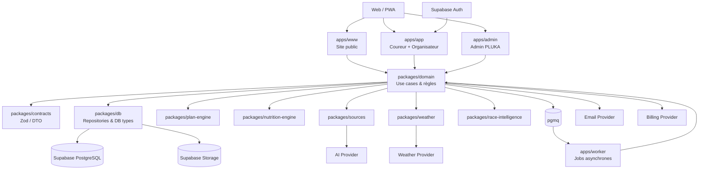
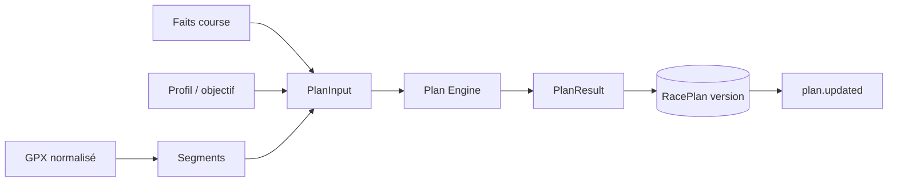
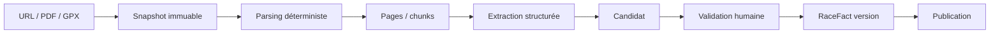
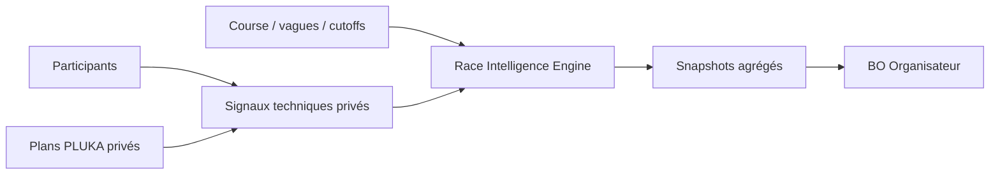

# PLUKA — Architecture technique V1

**Fichier de référence :** `docs/01_ARCHITECTURE.md`  
**Statut :** Référence d’architecture — Product Design Freeze V1  
**Date :** 2026-09-03  
**Langue de référence :** français

---

## 0. Rôle de ce document

Ce document décrit **comment PLUKA V1 doit être construit techniquement** : architecture applicative, frontières de responsabilités, organisation du code, flux synchrones et asynchrones, sécurité, persistance, intégrations, observabilité, tests et déploiement.

Il complète :

- `00_PRODUCT_SPEC.md` pour le périmètre et les règles fonctionnelles ;
- `02_DATA_MODEL.md` et les migrations SQL pour les données ;
- `03_PRIVACY_RLS.md` pour les droits d’accès détaillés ;
- `04_ENTITLEMENTS.md` pour les droits commerciaux ;
- `05_ROUTES_FLOWS.md` pour les routes et parcours ;
- `06_DESIGN_SYSTEM.md` pour l’implémentation visuelle ;
- `/docs/engines/*` pour les moteurs métier.

Ce document ne doit pas être utilisé pour inventer une fonctionnalité absente de la Product Spec.

### 0.1 Ordre de priorité

En cas de contradiction :

1. `00_PRODUCT_SPEC.md` fait foi sur le comportement produit ;
2. la spec moteur spécialisée fait foi sur un calcul métier ;
3. `01_ARCHITECTURE.md` fait foi sur les frontières et choix techniques ;
4. `02_DATA_MODEL.md`, `03_PRIVACY_RLS.md` et les migrations font foi sur la structure et la sécurité des données ;
5. le prototype figé fait foi pour l’intention UX/UI, jamais pour un algorithme ;
6. une contradiction doit être signalée et documentée avant d’être arbitrée dans le code.

---

# 1. Décision d’architecture

## 1.1 Architecture cible

PLUKA V1 utilise une architecture :

> **Modular monolith TypeScript + worker asynchrone + PostgreSQL central.**

Le choix volontaire est de **ne pas démarrer avec des microservices**.

Les différentes expériences web partagent :

- le même modèle métier ;
- les mêmes contrats ;
- les mêmes moteurs ;
- la même base PostgreSQL ;
- les mêmes règles de sécurité ;
- les mêmes événements métier.

Les traitements longs, coûteux ou rejouables sont déportés dans un worker.

## 1.2 Objectifs

Cette architecture doit permettre :

- de livrer rapidement une bêta fiable ;
- de garder les moteurs Plan et Nutrition testables indépendamment du framework ;
- de préserver la provenance des informations ;
- de protéger strictement les données personnelles ;
- de supporter le B2C et le B2B sans créer deux backends ;
- de traiter PDF, GPX, météo, emails et agrégats en asynchrone ;
- de pouvoir évoluer sans migration prématurée vers des microservices.

## 1.3 Ce que l’architecture doit éviter

Ne pas construire :

- un microservice par domaine ;
- un backend différent pour le B2B ;
- de logique métier importante dans les composants React ;
- de calcul Plan ou Nutrition dans le navigateur ;
- de `service_role` Supabase dans le client ;
- un couplage direct des moteurs à OpenAI, un provider météo ou un fournisseur d’email ;
- un modèle où le prototype devient du code métier ;
- une dépendance à des Edge Functions pour toutes les opérations serveur.

---

# 2. Stack cible

| Couche | Choix V1 |
|---|---|
| Langage | TypeScript strict |
| Monorepo | pnpm + Turborepo |
| Web | Next.js 16.x, App Router |
| UI | React + Design System PLUKA |
| Hébergement web | Vercel |
| Base | Supabase PostgreSQL |
| Auth | Supabase Auth |
| Fichiers | Supabase Storage |
| Géospatial | PostGIS |
| Recherche sémantique | pgvector |
| Queue | Supabase Queues / pgmq |
| Scheduler | Supabase Cron / pg_cron |
| Worker | Node.js / TypeScript en container |
| Validation | Zod |
| Tests unitaires | Vitest |
| Tests E2E | Playwright |
| Tests SQL/RLS | pgTAP et tests d’intégration |
| Observabilité | Sentry + logs structurés |
| IA | Provider abstrait ; extraction et réponses sourcées uniquement |
| Météo | Provider abstrait |
| Email | Provider transactionnel abstrait |
| Paiement | Provider abstrait ; entitlements stockés dans PLUKA |

Les versions patch exactes doivent être figées au bootstrap du repository et mises à jour selon une politique de maintenance documentée.

---

# 3. Vue d’ensemble



### Principe

**Next.js orchestre l’expérience. Le domaine porte les règles. PostgreSQL porte la vérité. Les moteurs calculent. Les providers restent remplaçables.**

---

# 4. Organisation du repository

Structure cible :

```text
/
├── AGENTS.md
├── README.md
├── docs/
├── reference/
├── supabase/
│   ├── migrations/
│   ├── seed.sql
│   └── tests/
│
├── apps/
│   ├── www/
│   ├── app/
│   ├── admin/
│   └── worker/
│
└── packages/
    ├── ui/
    ├── contracts/
    ├── db/
    ├── domain/
    ├── plan-engine/
    ├── nutrition-engine/
    ├── sources/
    ├── weather/
    ├── race-intelligence/
    ├── analytics/
    ├── notifications/
    └── config/
```

## 4.1 `apps/www`

Responsabilités :

- Homepage coureur ;
- Homepage organisateur ;
- pages marketing ;
- pages publiques de courses lorsqu’elles existent ;
- SEO ;
- conversion vers l’application.

Règles :

- aucune donnée privée ;
- indexable ;
- SSR / SSG / ISR selon le besoin ;
- forte performance ;
- pas de logique métier critique.

## 4.2 `apps/app`

Application authentifiée principale :

- Accueil coureur ;
- Ma saison ;
- Courses ;
- Plan ;
- Nutrition ;
- Préparation ;
- Assistance ;
- Conditions ;
- Sorties ;
- Bibliothèque ;
- Communauté ;
- Demander à PLUKA ;
- espace Organisateur.

Le B2B reste dans la même application et le même domaine métier. Il ne possède pas son propre backend.

## 4.3 `apps/admin`

Administration interne PLUKA :

- base course ;
- organisations ;
- sources ;
- facts ;
- validation ;
- produits Nutrition ;
- signalements ;
- support ;
- traitements techniques utiles.

Accès réservé aux administrateurs PLUKA.

## 4.4 `apps/worker`

Processus Node.js durable consommant les jobs asynchrones.

Il ne contient pas une copie des règles métier : il appelle les mêmes services de domaine et moteurs que les applications web.

## 4.5 Packages

### `packages/ui`

Composants du Design System et primitives réutilisables.

### `packages/contracts`

Schémas Zod, types de commande, DTO, contrats de providers et événements.

### `packages/db`

- client PostgreSQL / Supabase serveur ;
- repositories ;
- types générés ;
- helpers transactionnels ;
- aucun comportement produit complexe.

### `packages/domain`

Use cases applicatifs et règles transversales :

- participant ;
- organisation ;
- entitlements ;
- publication ;
- préparation ;
- Assistance ;
- Brief ;
- orchestration de recalculs.

### `packages/plan-engine`

Moteur Plan pur, déterministe et versionné.

### `packages/nutrition-engine`

Moteur Nutrition pur, déterministe et versionné.

### `packages/sources`

Parsing, chunking, retrieval, extraction, provenance et contrats IA.

### `packages/weather`

Normalisation provider, mapping Plan/GPX, forecast runs et périodes de Conditions.

### `packages/race-intelligence`

Calculs agrégés B2B.

**Le moteur réel Race Intelligence reste feature-flaggé tant que sa spec dédiée n’est pas validée.**

### `packages/analytics`

Événements métier first-party et agrégations internes.

### `packages/notifications`

Templates et orchestration email / notifications.

---

# 5. Règles de dépendances

Pour éviter un monolithe illisible :

```text
apps/*
  ↓
domain
  ↓
contracts + engines + repositories
  ↓
db / provider adapters
```

Règles :

1. Un moteur pur ne dépend jamais de Next.js.
2. Un moteur pur ne dépend jamais de Supabase.
3. Un moteur pur ne fait aucun appel réseau.
4. Un composant React ne porte pas un calcul métier complexe.
5. `packages/db` ne décide pas d’un entitlement.
6. Le provider météo ne décide pas d’une adaptation Nutrition.
7. L’IA ne publie jamais directement un RaceFact.
8. Les packages ne doivent pas importer les applications.
9. Les dépendances circulaires entre domaines sont interdites.

---

# 6. Frontend et stratégie de rendu

| Surface | Rendu recommandé | Indexation |
|---|---|---|
| `pluka.run` | SSR / SSG / ISR | Oui |
| Pages course publiques | SSG / ISR | Oui si publiées |
| `app.pluka.run` | RSC + Client Components ciblés | Non |
| Espace organisateur | Même app | Non |
| `admin.pluka.run` | RSC + client ciblé | Non |
| Lien Assistance | SSR public tokenisé | Non |
| Brief partagé | SSR public tokenisé | Non |

## 6.1 Server Components

À privilégier pour :

- lectures ;
- navigation ;
- pages de référence ;
- facts ;
- dashboard ;
- listes ;
- Brief.

## 6.2 Client Components

Réservés aux interactions qui le nécessitent :

- profil altimétrique interactif ;
- édition du Plan ;
- bottom sheets ;
- checklists ;
- Nutrition interactive ;
- drag / sélection ;
- états offline ;
- dataviz B2B interactives.

## 6.3 Mutations

Les mutations métier passent par :

- Server Actions ;
- Route Handlers ;
- services de domaine.

Les écritures critiques ne doivent pas être réalisées directement depuis le navigateur vers les tables.

Les lectures directes sous RLS ne sont autorisées que si elles sont explicitement prévues et testées.

---

# 7. API applicative

PLUKA V1 ne nécessite pas une API REST publique séparée.

Les commandes métier doivent être explicites.

Exemples :

```text
createParticipantRace
updateTrailProfile
setRaceGoal
generateRacePlan
updatePlanStop
updatePlanSegment
lockPlanWaypoint
rebalancePlan
activateNutrition
applyNutritionProposal
updatePreparationItem
createOuting
inviteAssistant
revokeAssistantLink
publishRaceFact
publishOfficialNotice
importParticipants
sendParticipantInvitations
generateOrganizerBrief
```

Chaque commande :

1. valide ses entrées ;
2. vérifie l’autorisation ;
3. exécute les invariants métier ;
4. écrit dans une transaction si nécessaire ;
5. émet ses effets secondaires après succès.

---

# 8. PostgreSQL comme source de vérité

PostgreSQL est le **système de référence métier unique**.

Supabase fournit la plateforme ; le modèle doit rester compréhensible et portable comme modèle PostgreSQL.

Principes :

- UUID pour les identifiants métier ;
- `timestamptz` pour les instants ;
- timestamps en UTC en stockage ;
- timezone locale de la Race conservée explicitement ;
- `jsonb` seulement lorsque la structure est réellement variable ;
- contraintes SQL pour les invariants simples ;
- index créés à partir des usages réels ;
- migrations versionnées ;
- aucune modification manuelle de production non reproduite en migration.

---

# 9. RLS et frontière de sécurité

La migration initiale active RLS en **deny-by-default**. Les policies détaillées appartiennent à `03_PRIVACY_RLS.md`.

Principes structurants :

- `anon` et `authenticated` n’obtiennent aucun accès par défaut ;
- le schéma `private` n’est jamais exposé au client ;
- `service_role` n’est jamais livré au navigateur ;
- l’organisation ne lit jamais le Plan, Nutrition, Assistance, sorties ou notes privées d’un coureur ;
- Race Intelligence lit des résultats agrégés autorisés ;
- les groupes B2B trop petits ne sont pas affichables ;
- les liens Assistance et Brief utilisent des tokens limités et révocables.

La RLS est une barrière de sécurité, pas un remplacement des contrôles métier serveur.

---

# 10. Authentification

## 10.1 Coureur

Supabase Auth.

Méthodes V1 possibles :

- magic link / OTP email ;
- OAuth Google si retenu au bootstrap.

Ne pas rendre le mot de passe obligatoire.

## 10.2 Participant invité

L’invitation métier existe indépendamment du compte.

Flow :

```text
participant_import
→ participant_race
→ invitation
→ authentification
→ rattachement sécurisé au user
```

Le rattachement doit vérifier que l’utilisateur authentifié est autorisé à réclamer cette invitation.

## 10.3 Organisation

Même système d’authentification.

L’autorisation provient de `organization_members`.

## 10.4 Admin PLUKA

Rôle plateforme séparé.

MFA fortement recommandé avant ouverture production des fonctions sensibles.

---

# 11. Entitlements

Les règles commerciales ne doivent pas être dispersées dans l’UI.

Créer un service de domaine unique :

```text
EntitlementService
```

Il répond à des questions métier :

```text
canEditPlan(user, participantRace)
canUseNutrition(...)
canUseRaceConditions(...)
canCreateOuting(...)
canUseOutingConditions(...)
canUseLibrary(...)
```

Sources possibles :

- Free implicite ;
- Race Pass ;
- PLUKA+ ;
- Organizer Included ;
- accès bêta / testeur explicitement configuré.

L’UI peut masquer ou afficher une action, mais **le serveur doit revérifier le droit lors de la mutation**.

Le provider de paiement ne devient jamais la source directe de vérité des droits applicatifs.

---

# 12. Plan Engine

Référence : `docs/engines/PLAN_ENGINE.md`.

Principes d’architecture :

- bibliothèque TypeScript pure ;
- aucune dépendance UI ;
- aucun appel réseau ;
- aucun LLM ;
- entrées validées ;
- résultat déterministe à version de moteur identique ;
- `engine_version` persistée ;
- `input_hash` persistant pour reproductibilité ;
- calcul définitif côté serveur.

Pipeline conceptuel :



Une modification significative crée une nouvelle version ou un nouvel état versionné selon la spec moteur.

Les personnalisations explicites ne sont jamais écrasées silencieusement.

---

# 13. Nutrition Engine

Référence : `docs/engines/NUTRITION_ENGINE.md`.

Même philosophie que Plan :

- moteur pur ;
- déterministe ;
- versionné ;
- aucun LLM ;
- aucune prescription médicale ;
- cibles choisies ou validées par l’utilisateur.

Entrées principales :

- Plan actif ou sortie ;
- objectifs nutritionnels ;
- produits sélectionnés ;
- ravitos ;
- périodes chaud / froid / nuit ;
- règles de réserve.

Une modification du Plan produit un **diff**. Les jalons personnalisés ne sont jamais déplacés silencieusement.

Une adaptation issue des Conditions météo reste :

```text
détection
→ proposition
→ aperçu de l’impact
→ confirmation utilisateur
→ application
```

Jamais :

```text
météo
→ mutation automatique de Nutrition
```

---

# 14. Sources, extraction et provenance

Référence : `docs/engines/SOURCES_EXTRACTION.md`.

## 14.1 Principe

Une source n’est jamais directement une vérité métier.

Pipeline :



## 14.2 IA

L’IA peut aider à :

- interpréter une page complexe ;
- extraire des candidats structurés ;
- normaliser un contenu ;
- répondre à une question à partir de preuves.

L’IA ne peut pas :

- publier seule un fait officiel ;
- modifier un RaceFact publié sans workflow ;
- définir le pacing ;
- décider d’un entitlement ;
- écrire une règle de sécurité.

## 14.3 Provenance

Chaque fait publié doit pouvoir revenir jusqu’à :

- source ;
- snapshot ;
- page / section ;
- extrait ;
- validation.

Une nouvelle version de source ne remplace jamais silencieusement une valeur publiée.

---

# 15. GPX et géospatial

PostGIS est utilisé pour :

- géométrie de course ;
- waypoints ;
- projection des points sur la trace ;
- segments ;
- calculs de distance ;
- points virtuels Conditions ;
- futures requêtes géographiques.

Pipeline GPX :

1. valider le fichier ;
2. parser ;
3. nettoyer les points invalides ;
4. calculer distance et altitude ;
5. normaliser ;
6. créer la géométrie PostGIS ;
7. raccorder les waypoints ;
8. produire les segments / micro-segments utiles ;
9. enregistrer la version du processeur.

Le GPX brut n’est pas reparsé à chaque recalcul du Plan.

---

# 16. Conditions météo

Référence : `docs/engines/WEATHER_CONDITIONS.md`.

## 16.1 Frontière provider

Le code domaine dépend d’une interface :

```text
WeatherProvider
```

et non d’un fournisseur concret.

Le provider reçoit notamment :

- latitude ;
- longitude ;
- altitude de parcours ;
- datetime locale / UTC résolue.

Il retourne un format normalisé :

- température ;
- ressenti ;
- précipitations ;
- vent ;
- rafales ;
- direction ;
- code de condition ;
- timestamp de mise à jour.

## 16.2 J-14

La règle J-14 est **métier**, pas UI.

Le serveur ne doit pas générer / exposer de Conditions personnalisées avant la fenêtre autorisée.

Une information officielle organisateur reste accessible indépendamment de cette règle.

## 16.3 Forecast runs

Un `weather_forecast_run` est un snapshot.

Un changement de Plan :

- modifie les `plannedDatetime` ;
- déclenche ou sélectionne un forecast cohérent ;
- ne réécrit pas rétroactivement un ancien run.

## 16.4 Mapping

Les points visibles sont des points utiles :

- waypoints Plan ;
- points significatifs ;
- checkpoints météo virtuels si une longue section le nécessite.

Pas un appel provider pour chaque point GPX.

## 16.5 Propagation

```text
Plan ETA
→ Conditions
→ périodes significatives
→ propositions Nutrition / Préparation
→ validation utilisateur
```

La météo ne modifie jamais automatiquement le pacing.

---

# 17. Assistance

Le domaine Assistance dépend du Plan actif sans devenir du tracking.

Principes :

- rendez-vous rattaché à un waypoint autorisé ;
- ETA dérivée du Plan ;
- fenêtre autour du passage estimé ;
- recalcul après changement du Plan ;
- page accompagnant minimale ;
- aucune position live.

## 17.1 Lien privé

Route publique tokenisée.

Règles :

- token brut jamais stocké en base ;
- hash en base ;
- expiration configurable ;
- révocation immédiate ;
- rate limiting ;
- données minimales ;
- pas d’indexation ;
- ne pas conserver durablement des données privées en cache partagé.

---

# 18. Sorties personnelles

Une sortie est un objet distinct d’une Race.

Elle réutilise :

- GPX ;
- timeline ;
- Nutrition ;
- matériel ;
- Conditions.

Elle ne doit pas artificiellement devenir une `race`.

Race Pass peut autoriser jusqu’à deux sorties liées à une participation. PLUKA+ autorise les sorties personnelles selon `04_ENTITLEMENTS.md`.

Le quota est calculé par le service d’entitlement, pas par un compteur mutable côté UI.

---

# 19. Demander à PLUKA

Architecture de retrieval :

```text
Question
→ scope utilisateur / race / outing
→ facts structurés pertinents
→ chunks de sources autorisés
→ génération de réponse
→ citations
```

Priorité :

1. faits structurés publiés ;
2. chunks de sources correspondants ;
3. réponse prudente.

Si l’information fiable manque :

> PLUKA doit savoir répondre qu’il ne l’a pas trouvée.

Les conversations personnelles ne sont jamais exposées directement à l’organisation.

Les insights B2B proviennent d’un pipeline d’agrégation séparé.

---

# 20. Race Intelligence B2B

La Product Spec autorise l’UI Race Intelligence en V1/bêta mais le moteur réel doit posséder une spec dédiée avant production.

## 20.1 Principe de confidentialité

Le moteur peut exploiter côté serveur des signaux individuels autorisés pour construire un résultat **agrégé**.

Le BO organisation ne reçoit que :

- agrégats ;
- plages temporelles ;
- couvertures ;
- distributions ;
- insights respectant le seuil de confidentialité.

Il ne reçoit jamais une ETA personnelle.

## 20.2 Architecture



Les signaux individuels sont dans le schéma privé ou une frontière équivalente.

Le résultat affichable est persisté comme snapshot agrégé.

## 20.3 Règle de groupe

Aucun groupe inférieur au seuil défini dans la Product Spec / Privacy spec ne doit produire une sortie consultable côté organisation.

## 20.4 Feature flag

Tant que `RACE_INTELLIGENCE.md` n’a pas défini et validé le modèle réel :

- UI de démonstration possible ;
- fixtures possibles ;
- moteur production non activé.

---

# 21. Questions participants et Brief organisateur

## 21.1 Insights

Les questions individuelles servent à construire des catégories et volumes agrégés.

Pipeline :

```text
question individuelle
→ classification technique
→ agrégation par race / période / thème
→ seuil confidentialité
→ question_insight_snapshot
→ BO
```

Le BO ne lit pas directement `pluka_messages`.

## 21.2 Brief organisateur

Le Brief est généré à partir de **données déjà autorisées** :

- état Course ;
- conflits / changements ;
- agrégats peloton ;
- flux ;
- insights questions ;
- Conditions agrégées.

Il ne doit pas requêter des données personnelles lors de son rendu public.

Un Brief partagé doit être un snapshot nettoyé et autorisé.

---

# 22. Jobs asynchrones

Créer des types de jobs explicites.

| Job | Déclencheur | Traitement |
|---|---|---|
| `source.ingest` | nouvelle source | snapshot, parsing |
| `source.extract` | snapshot prêt | extraction / candidats |
| `source.reindex` | contenu publié | embeddings / index |
| `gpx.process` | GPX ajouté | normalisation PostGIS |
| `plan.recompute` | objectif / segment / lock | recalcul Plan |
| `nutrition.recompute` | Plan / cibles | diff Nutrition |
| `assistance.refresh` | Plan modifié | ETA / fenêtres |
| `weather.refresh` | fenêtre J-14 / refresh | forecast run |
| `weather.remap` | Plan modifié | remapping ETA |
| `participant.import` | CSV | validation / import |
| `participant.enrich` | fichier enrichi | matching |
| `question.rollup` | cron / volume | insights agrégés |
| `organizer-brief.generate` | changement utile / cron | Brief |
| `race-intelligence.compute` | données disponibles | agrégats B2B |
| `analytics.rollup` | cron | snapshots adoption |
| `email.send` | invitation / notification | envoi |
| `racepack.build` | demande / approche course | bundle offline |

## 22.1 Idempotence

Chaque job possède :

- `idempotency_key` ;
- nombre de tentatives ;
- statut ;
- timestamps ;
- erreur normalisée.

Un retry ne doit pas :

- dupliquer une invitation ;
- publier deux fois un fait ;
- créer deux versions identiques de Plan ;
- envoyer deux emails transactionnels lorsque l’idempotence peut l’éviter.

## 22.2 Outbox

Les opérations critiques qui nécessitent une mutation DB + un effet asynchrone utilisent l’outbox.

Exemple :

```text
transaction :
  update race_plan
  insert outbox_event(plan.updated)
commit

dispatcher :
  outbox_event
  → pgmq
```

Cela évite qu’un Plan soit modifié en base sans que Nutrition / Assistance puissent être recalculées.

---

# 23. Événements métier

Événements structurants :

```text
race.fact.published
race.official_notice.published
race.course_geometry.updated
participant.imported
participant.invited
participant.activated
plan.generated
plan.updated
nutrition.updated
preparation.updated
assistance.configured
outing.created
weather.updated
pluka.question.asked
postrace.completed
```

Un événement métier n’est pas nécessairement un événement analytics.

Les payloads doivent être minimaux et éviter les données personnelles inutiles.

---

# 24. Analytics

Les analytics B2B ne dépendent pas d’un SDK tiers comme source de vérité.

PLUKA stocke des événements first-party puis produit des agrégats.

Un outil externe peut servir à :

- comprendre l’usage produit ;
- analyser les performances ;
- améliorer les funnels internes.

Mais :

> **les chiffres montrés à un organisateur doivent être calculables à partir des données PLUKA autorisées.**

Ne pas envoyer vers des outils analytics externes des données personnelles sensibles ou des contenus Nutrition / Assistance / conversations sans justification spécifique.

---

# 25. Storage

Buckets conceptuels :

```text
public-assets
race-sources
source-snapshots
gpx
participant-exports
generated-exports
```

Principes :

- assets publics séparés ;
- sources privées par défaut ;
- snapshots de preuves conservés ;
- fichiers participants privés ;
- URLs signées pour contenu privé ;
- contrôle MIME, extension, taille et signature ;
- nom de fichier utilisateur jamais utilisé comme chemin de confiance.

Les règles exactes seront alignées avec `03_PRIVACY_RLS.md`.

---

# 26. PWA et offline

Le B2C doit être PWA-ready.

Objectif prioritaire : accès à l’essentiel en réseau montagne dégradé.

## 26.1 Race Pack

Le Race Pack peut contenir :

- Plan actif ;
- waypoints ;
- barrières ;
- Nutrition utile ;
- matériel ;
- sacs ;
- Assistance ;
- informations officielles critiques ;
- Conditions dernièrement synchronisées ;
- métadonnées de fraîcheur.

## 26.2 Stockage local

- IndexedDB pour données structurées ;
- Cache API pour assets ;
- version du Race Pack ;
- timestamp de synchronisation.

## 26.3 Offline-first limité

V1 :

- lecture offline de l’essentiel ;
- checklists simples éventuellement modifiables offline ;
- synchronisation avec gestion de conflit simple.

V1 reste **online-first** pour :

- modification complexe du Plan ;
- Nutrition structurante ;
- changement d’objectif ;
- publication organisateur ;
- administration.

Aucune donnée locale ancienne ne doit être affichée comme fraîche sans indication de la dernière synchronisation.

---

# 27. Cache applicatif

## 27.1 Public

Utiliser le cache Next / CDN pour :

- Homepage ;
- pages course publiques ;
- facts publiés non sensibles.

Invalidation lors d’une publication importante.

## 27.2 Privé

Les pages personnelles ne doivent pas être mises en cache publiquement.

Utiliser :

- lectures serveur ;
- cache utilisateur ciblé uniquement si nécessaire ;
- invalidation explicite après mutation.

## 27.3 Météo

Le cache météo dépend du provider et de l’horizon.

PLUKA persiste ses forecast runs afin de conserver :

- provenance ;
- fraîcheur ;
- cohérence avec l’ETA utilisée.

Le cache fournisseur ne remplace pas le snapshot métier PLUKA.

---

# 28. Providers externes

Chaque dépendance externe doit être derrière un contrat.

Interfaces conceptuelles :

```text
AIProvider
WeatherProvider
EmailProvider
BillingProvider
GeocodingProvider   // uniquement si nécessaire plus tard
```

Le domaine ne connaît pas le SDK concret.

Avantages :

- testabilité ;
- changement de fournisseur ;
- contrôle des coûts ;
- gestion des pannes ;
- mock local.

## 28.1 Paiement

Les achats sont traités par un provider de paiement choisi au moment de l’intégration commerciale.

Le webhook provider :

```text
payment event
→ validation signature
→ commande domaine
→ entitlement PLUKA
```

Ne pas utiliser le statut provider directement dans les composants pour autoriser une feature.

---

# 29. Gestion du temps et des fuseaux

Règle :

- stocker les instants en `timestamptz` ;
- conserver la timezone IANA de la Race ;
- résoudre les horaires de passage en vraie date/heure ;
- ne jamais représenter un ultra multi-jour uniquement comme « minutes depuis le départ » au niveau des intégrations externes.

Le moteur peut utiliser des durées internes, mais les frontières météo, Assistance, notifications et UI doivent pouvoir reconstruire une vraie date locale.

---

# 30. Versionnement et reproductibilité

Tout calcul métier important doit connaître sa version.

À versionner au minimum :

- processeur GPX ;
- moteur Plan ;
- moteur Nutrition ;
- extraction ;
- configuration météo / normalisation si elle change le sens métier ;
- Race Intelligence lorsqu’il sera activé.

Persistances utiles :

```text
engine_version
processor_version
input_hash
computed_at
calculation_reason
```

Objectif :

> comprendre pourquoi un utilisateur avait obtenu un résultat donné à une date donnée.

---

# 31. Transactions et cohérence

Utiliser une transaction PostgreSQL lorsque plusieurs écritures doivent réussir ensemble.

Exemples :

- publication d’une RaceFactVersion + mise à jour `current_version_id` ;
- création d’un Plan + détails ;
- activation d’une entitlement issue d’un paiement validé ;
- rattachement invitation → compte ;
- révocation / régénération d’un token privé.

Ne pas maintenir une transaction ouverte pendant :

- appel IA ;
- appel météo ;
- envoi email ;
- traitement lourd.

Ces opérations passent par jobs / outbox.

---

# 32. Sécurité applicative

Mesures minimales :

- TypeScript strict ;
- validation Zod à chaque frontière non fiable ;
- RLS ;
- contrôle serveur des permissions ;
- rate limiting sur routes publiques sensibles ;
- CSRF / protections standard du framework ;
- CSP adaptée ;
- cookies sécurisés ;
- secrets uniquement serveur ;
- URLs signées ;
- tokens hashés ;
- logs sans secrets ;
- validation stricte des uploads ;
- prévention SSRF sur ingestion URL ;
- timeouts sur providers ;
- taille maximale des fichiers ;
- audit des actions critiques.

## 32.1 Ingestion URL et SSRF

Toute URL fournie par un utilisateur ou une organisation doit :

- utiliser `http` ou `https` ;
- refuser localhost et réseaux privés ;
- résoudre / valider la destination ;
- limiter les redirections ;
- limiter la taille téléchargée ;
- appliquer un timeout ;
- journaliser le domaine source.

---

# 33. Confidentialité et minimisation

L’architecture suit une logique privacy-by-design.

Principes :

- ne pas dupliquer inutilement les PII ;
- ne pas mettre de données Nutrition ou Assistance dans les analytics ;
- ne pas loguer le contenu complet des conversations par défaut ;
- ne pas exposer des données individuelles au B2B ;
- agréger côté serveur ;
- conserver les tokens sous forme hashée ;
- documenter les politiques de rétention avant production ;
- prévoir suppression / anonymisation utilisateur.

Les politiques exactes appartiennent à `03_PRIVACY_RLS.md`.

---

# 34. Observabilité

## 34.1 Erreurs

Sentry pour :

- erreurs frontend ;
- erreurs serveur ;
- worker ;
- traces critiques.

Ne pas inclure de données personnelles sensibles dans les breadcrumbs ou payloads.

## 34.2 Logs structurés

Chaque requête / job important utilise :

```text
request_id
job_id
user_id si nécessaire
organization_id si nécessaire
race_id
operation
duration_ms
status
```

Les IDs peuvent être utiles ; les contenus personnels ne doivent pas être logués par défaut.

## 34.3 Métriques

Suivre notamment :

- taux d’erreur ;
- latence ;
- taille des queues ;
- âge du job le plus ancien ;
- retries ;
- échecs providers ;
- temps de génération Plan ;
- coût / volume IA ;
- appels météo ;
- temps d’ingestion ;
- taux d’extraction nécessitant revue humaine.

---

# 35. Résilience provider

Chaque provider doit avoir :

- timeout ;
- retry borné lorsque pertinent ;
- gestion explicite des erreurs ;
- circuit de dégradation métier.

Exemples :

### Météo indisponible

Afficher :

> Conditions indisponibles pour le moment.

Ne jamais fabriquer une valeur.

### IA indisponible

L’ingestion passe en échec / attente. Une donnée déjà publiée reste accessible.

### Email indisponible

L’invitation reste persistée et le job est retenté.

### Paiement webhook en retard

Ne pas simuler une entitlement premium côté client.

---

# 36. Tests

## 36.1 Unitaires

Vitest.

Priorité maximale :

- Plan Engine ;
- Nutrition Engine ;
- EntitlementService ;
- mapping Conditions ;
- calcul de périodes ;
- helpers de timezones ;
- règles de publication ;
- transformations de données.

## 36.2 Intégration PostgreSQL

Tester sur une vraie base locale :

- migrations ;
- contraintes ;
- transactions ;
- versioning ;
- triggers ;
- repositories.

## 36.3 RLS

Tests dédiés par rôle :

- anon ;
- coureur A ;
- coureur B ;
- assistant token ;
- organisation owner/admin/editor/viewer ;
- PLUKA admin/service.

Tester explicitement les interdictions.

## 36.4 E2E

Playwright sur les flows critiques :

- nouveau coureur ;
- invitation organisateur ;
- génération Plan ;
- édition Plan ;
- Nutrition ;
- Assistance ;
- Race Pass / entitlement ;
- sortie ;
- Conditions J-14 ;
- publication organisateur ;
- import participants.

## 36.5 Tests d’extraction

Corpus « gold » de documents.

Mesurer :

- extraction cutoff ;
- matériel ;
- assistance ;
- citations ;
- faux positifs ;
- non-régression.

## 36.6 Providers

Contract tests avec mocks / fixtures normalisées.

Aucun test moteur ne doit dépendre d’un appel externe réel.

---

# 37. CI/CD

Pipeline minimum sur chaque PR :

```text
install
→ lint
→ typecheck
→ unit tests
→ build
→ migration validation
→ tests DB/RLS
→ E2E critique selon pipeline
```

Sur merge vers la branche principale :

- déploiement staging ;
- smoke tests ;
- migration contrôlée ;
- déploiement production selon stratégie choisie.

Les migrations DB doivent être appliquées avant un code qui en dépend, avec compatibilité temporaire si nécessaire.

---

# 38. Environnements

Minimum :

```text
local
staging
production
```

Les previews Vercel :

- n’utilisent jamais les secrets production lorsqu’ils n’en ont pas besoin ;
- ne doivent pas écrire dans la base production.

Supabase :

- local pour développement ;
- projet staging dédié ;
- projet production dédié.

Les seeds de démonstration n’entrent pas en production.

---

# 39. Migrations

Règles :

- migrations forward-only ;
- pas de modification d’une migration déjà partagée / appliquée ;
- migrations petites et lisibles ;
- séparation structure / RLS lorsque utile ;
- scripts de backfill séparés pour opérations lourdes ;
- revue obligatoire sur suppression ou changement destructif.

Le fichier `0001_initial_schema.sql` constitue le point de départ canonique.

---

# 40. Données de démonstration

Le prototype contient des valeurs simulées.

Elles peuvent devenir :

- fixtures ;
- stories ;
- seeds locaux ;
- scénarios Playwright.

Elles ne doivent jamais devenir :

- constantes moteur ;
- seuils métier ;
- données production ;
- preuve d’un partenariat.

Les références à des courses réelles dans la démo doivent rester identifiées comme démonstration sans affiliation.

---

# 41. Feature flags

Utiliser des feature flags pour les fonctionnalités dont l’UX existe mais dont le moteur réel n’est pas encore validé.

Minimum :

```text
repere_pluka
race_intelligence
community
advanced_offline
```

Les flags ne doivent pas remplacer les entitlements.

Différence :

- **feature flag** = la fonctionnalité existe-t-elle dans cette release ?
- **entitlement** = cet utilisateur a-t-il le droit de l’utiliser ?

---

# 42. Performance

Objectifs qualitatifs V1 :

- chargement public rapide ;
- interactions Plan fluides ;
- aucune ingestion lourde dans le cycle HTTP ;
- aucune attente d’appel IA pour afficher une page normale ;
- calcul Plan rapide et borné ;
- dataviz B2B rendue à partir d’agrégats pré-calculés ;
- géométries GPX simplifiées pour l’affichage.

Ne pas optimiser prématurément avec Redis, Kafka ou microservices.

Ajouter une nouvelle infrastructure uniquement après mesure d’un goulot réel.

---

# 43. Scalabilité

Cette architecture peut aller significativement au-delà d’une bêta.

Les premiers points de pression probables sont :

1. ingestion documentaire / IA ;
2. volume de jobs ;
3. calcul Race Intelligence ;
4. météo sur de nombreux parcours ;
5. analytics.

Ils peuvent être scalés séparément grâce au worker et aux queues sans découper immédiatement le domaine en microservices.

Évolution possible plus tard :

- plusieurs workers par type de queue ;
- cache spécialisé ;
- service d’ingestion isolé ;
- warehouse analytics ;
- moteur Race Intelligence dédié.

Ce sont des options, pas des exigences V1.

---

# 44. Ordre de construction recommandé

| Lot | Contenu |
|---|---|
| 0 | Monorepo, CI, config, Supabase local, migrations, Auth, Design System |
| 1 | Event / Edition / Race, sources, GPX, facts, Admin PLUKA |
| 2 | ParticipantRace, Profil trailer, onboarding, entitlements |
| 3 | Plan Engine + persistance + UI Plan |
| 4 | Préparation / matériel / sacs / TODO |
| 5 | Nutrition Engine + UI |
| 6 | Assistance + lien privé |
| 7 | Conditions météo J-14 |
| 8 | Ma saison + sorties + bibliothèque |
| 9 | Demander à PLUKA |
| 10 | B2B Course + imports + invitations |
| 11 | Insights questions + adoption + Brief organisateur |
| 12 | Race Intelligence bêta après spec moteur dédiée |
| 13 | Après-course + Communauté light |
| 14 | Race Pack / PWA + hardening sécurité/performance |

Cet ordre peut être découpé en tranches verticales plus petites. Il ne constitue pas un engagement de release simultanée.

---

# 45. ADR à figer

## ADR-001 — Modular Monolith

Un domaine partagé + worker. Pas de microservices V1.

## ADR-002 — PostgreSQL / Supabase

PostgreSQL est la source de vérité. Supabase fournit Auth, Storage, RLS, Queues et tooling.

## ADR-003 — Server-authoritative

Les mutations métier et calculs définitifs sont validés côté serveur.

## ADR-004 — Plan déterministe

Aucun LLM dans le pacing.

## ADR-005 — Nutrition déterministe

Aucun LLM dans le calcul Nutrition.

## ADR-006 — Provenance

Toute information critique publiée doit être traçable vers une source versionnée.

## ADR-007 — Officialité

Seule une organisation autorisée peut donner le niveau `official`.

## ADR-008 — Versioning

Les faits, sources et calculs importants sont versionnés ou snapshotés.

## ADR-009 — Privacy B2B

Les organisations consomment des agrégats, pas les préparations personnelles.

## ADR-010 — Providers abstraits

IA, météo, email et paiement sont derrière des interfaces.

## ADR-011 — Weather ≠ pacing

Les Conditions peuvent produire des propositions, jamais modifier automatiquement le pacing.

## ADR-012 — Race Intelligence feature-flaggé

Aucun moteur de production n’est déduit des fixtures du prototype.

## ADR-013 — Entitlements centralisés

Les droits sont calculés par un service de domaine et revérifiés côté serveur.

## ADR-014 — Public / privé séparés

Les données publiques peuvent être indexées. Les expériences app/admin/assistance/brief sont noindex et protégées selon leur contexte.

---

# 46. Risques techniques prioritaires

| Risque | Niveau | Réponse |
|---|---|---|
| Qualité extraction documentaire | Élevé | validation humaine, provenance, corpus gold |
| Crédibilité moteur Plan | Élevé | déterminisme, tests terrain, versioning |
| Complexité RLS multi-rôles | Élevé | deny-by-default, pgTAP, tests d’interdiction |
| Propagation Plan → Nutrition / Assistance / Conditions | Élevé | événements métier + outbox + jobs idempotents |
| Race Intelligence interprétée comme vérité | Élevé | spec séparée, agrégats, langage prudent, feature flag |
| Liens privés | Moyen/élevé | token hashé, expiration, révocation, rate limit |
| Coût IA | Moyen | extraction mutualisée, cache, mesure par run |
| Coût / quota météo | Moyen | points significatifs, snapshots, cache |
| Offline montagne | Moyen | Race Pack ciblé |
| BO trop complexe | Moyen | conclusions pré-calculées, même domaine, pas de backend dédié |
| Dépendance provider | Moyen | adapters, contrats, mocks |
| Données de démo copiées en production | Élevé | fixtures séparées + règles AGENTS |

---

# 47. Critères d’acceptation de l’architecture

L’architecture est respectée si :

1. Plan et Nutrition peuvent tourner sans Next.js, Supabase ou IA.
2. PostgreSQL reste la source de vérité.
3. Les writes critiques sont autorisées côté serveur.
4. RLS est testée et deny-by-default.
5. Aucun `service_role` n’atteint le navigateur.
6. L’organisation ne peut pas lire les Plans individuels.
7. Les traitements longs utilisent la queue / worker.
8. Les jobs sont idempotents.
9. Les mutations critiques et leurs effets asynchrones ne se perdent pas silencieusement.
10. Les providers externes sont derrière des interfaces.
11. Une panne météo ne produit aucune valeur inventée.
12. L’IA ne peut pas publier seule une donnée officielle.
13. Le GPX est normalisé une fois puis réutilisé.
14. Les vraies dates/heures et timezones sont conservées pour Conditions.
15. Le Race Pack n’expose pas de données privées en cache public.
16. Les analytics organisateur lisent des agrégats.
17. Les moteurs non spécifiés restent feature-flaggés.
18. Les données de prototype restent des fixtures.
19. Une migration SQL peut reconstruire l’état de la base.
20. Le repository garde une séparation claire applications / domaine / moteurs / infrastructure.

---

# 48. Consigne à Claude Code

Lorsqu’une tâche est implémentée :

1. lire la Product Spec ;
2. lire cette architecture ;
3. lire le Data Model ;
4. lire la spec moteur concernée ;
5. lire les critères d’acceptation ;
6. inspecter le prototype uniquement pour l’UX ;
7. implémenter la plus petite tranche cohérente ;
8. ajouter / mettre à jour les tests ;
9. signaler toute contradiction documentaire ;
10. ne pas élargir spontanément le scope.

Le principe directeur est :

> **Faire simple à opérer, strict sur les données, déterministe sur les moteurs et explicite sur les frontières.**

---

**Fin — PLUKA Architecture technique V1**
