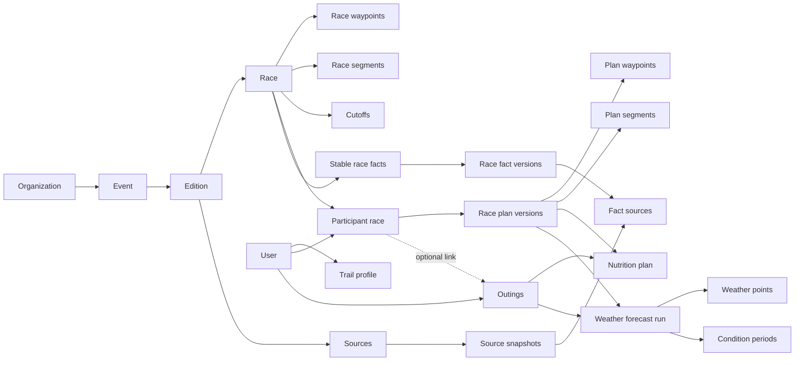
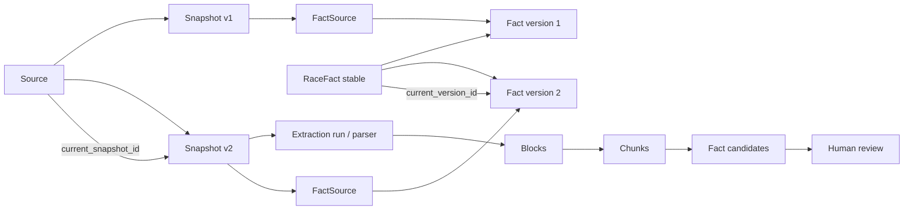
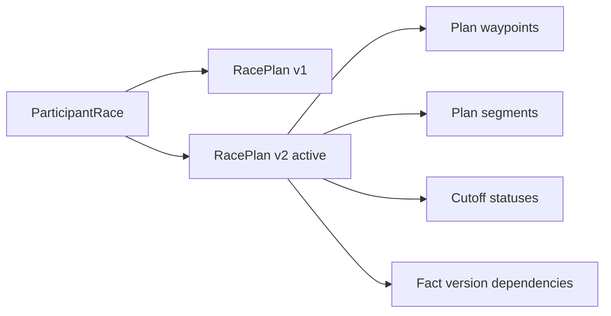
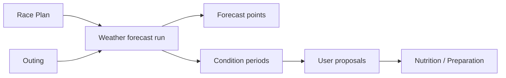

# PLUKA — Data Model V1

**Fichier de référence :** `docs/02_DATA_MODEL.md`  
**Schémas SQL associés :** `supabase/migrations/0001_initial_schema.sql` + `supabase/migrations/0002_domain_model_hardening.sql`  
**Statut :** Référence de données consolidée — Product / Engine Freeze V1  
**Date :** 2026-09-04  
**Langue de référence :** français

---

## 0. Rôle de ce document

Ce document décrit le **modèle de données canonique de PLUKA V1** : entités, responsabilités, relations, invariants et frontières de confidentialité.

Il complète :

- `00_PRODUCT_SPEC.md` pour le comportement fonctionnel ;
- `01_ARCHITECTURE.md` pour les choix techniques ;
- `03_PRIVACY_RLS.md` pour les politiques d'accès ;
- `04_ENTITLEMENTS.md` pour l'évaluation détaillée des droits ;
- les specs `/docs/engines/*` pour les moteurs métier.

Le SQL associé constitue la **traduction relationnelle de référence** de ce document.

### 0.1 Ordre de priorité

En cas de contradiction :

1. `00_PRODUCT_SPEC.md` fait foi sur le besoin fonctionnel ;
2. la spec moteur spécialisée fait foi sur un calcul métier ;
3. `02_DATA_MODEL.md` fait foi sur la structure conceptuelle des données ;
4. les migrations SQL font foi sur l'état réellement déployé de la base ;
5. le prototype fait foi pour l'intention UX, jamais pour une formule ou une donnée métier.

Une contradiction ne doit jamais être arbitrée silencieusement dans le code.

### 0.2 Ce modèle ne spécifie pas

Ce document ne redéfinit pas :

- l'algorithme du moteur Plan ;
- l'algorithme du moteur Nutrition ;
- le calcul du Repère PLUKA ;
- l'algorithme Race Intelligence, désormais spécifié dans `engines/RACE_INTELLIGENCE.md` ;
- les seuils calibrés Race Intelligence ;
- le fournisseur météo concret ;
- les seuils automatiques Chaud / Froid / Pluie tant que la configuration Conditions n'est pas calibrée ;
- les politiques RLS détaillées ;
- le découpage final des services applicatifs.

Le modèle doit en revanche **permettre de persister et reproduire** les décisions prises dans ces specs sans déporter des invariants critiques dans l'état React ou dans des JSON non documentés.

---

# 1. Principes de modélisation

## 1.1 PostgreSQL / Supabase comme système de référence

La base cible est PostgreSQL via Supabase.

Le modèle utilise notamment :

- UUID pour les identifiants métier ;
- `timestamptz` pour les instants ;
- `jsonb` uniquement pour des payloads réellement variables ou dérivés ;
- PostGIS pour les traces de parcours ;
- pgvector pour les chunks de sources utilisés par la recherche sémantique ;
- RLS comme frontière d'accès côté client.

## 1.2 Explicite plutôt que polymorphique

Les objets structurants sont modélisés explicitement :

- course officielle ;
- participation personnelle ;
- Plan ;
- sortie personnelle ;
- Nutrition ;
- Assistance ;
- Conditions ;
- analyse organisateur.

Le modèle évite autant que possible les tables génériques du type `objects`, `entities` ou `items` qui rendent les droits et invariants difficiles à comprendre.

## 1.3 Donnée source ≠ donnée personnelle ≠ donnée dérivée

Trois catégories doivent rester distinctes.

### Données de référence de course

Partagées entre tous les participants :

- parcours ;
- points ;
- barrières ;
- matériel ;
- règles ;
- sources ;
- faits publiés.

### Données personnelles

Appartiennent au coureur :

- objectif ;
- Plan ;
- Nutrition ;
- sacs ;
- Assistance ;
- sorties ;
- notes ;
- retours privés.

### Données dérivées B2B

Destinées à l'organisation uniquement sous forme agrégée :

- dispersion des vagues ;
- flux prévisionnels ;
- barrières à surveiller ;
- exposition météo du peloton ;
- questions fréquentes ;
- adoption.

Les données personnelles ne sont jamais exposées à l'organisation pour simplifier un calcul B2B.

---

# 2. Vue d'ensemble des domaines

Le schéma physique est volontairement plus riche que l'interface : **le nombre de tables ne correspond jamais au nombre de modules visibles**. Beaucoup sont des tables de détail, de version, de liaison, de preuve, de ledger ou de résultat dérivé.

Les domaines principaux sont :

1. Identité & Profil trailer
2. Organisations
3. Référentiel Event → Edition → Race
4. Sources & faits versionnés
5. Participation & entitlements
6. Plan
7. Changements officiels
8. Préparation
9. Sorties personnelles
10. Nutrition
11. Assistance
12. Bibliothèque
13. Conditions météo
14. Communauté & après-course
15. Imports / invitations / enrichissement B2B
16. Demander à PLUKA
17. Race Intelligence
18. Insights / Brief organisateur
19. Tables techniques privées

---

# 3. Relations structurantes



## 3.1 Hiérarchie de course

La hiérarchie de référence est :

> **Organization → Event → Edition → Race**

Une organisation peut gérer plusieurs événements. Un événement est récurrent. Une édition représente une occurrence datée. Une race représente une épreuve précise de cette édition.

Une course peut exister sans organisation revendiquée : PLUKA peut maintenir une course à partir de sources publiques. Dans ce cas, aucune donnée ne doit être qualifiée « officielle » au sens PLUKA sans validation d'une organisation autorisée.

---

# 4. Identité et Profil trailer

## 4.1 `users`

Profil applicatif lié 1:1 à `auth.users`.

Contient uniquement les informations utiles à l'application :

- email ;
- prénom / nom ;
- avatar ;
- locale ;
- timezone ;
- rôle plateforme.

Le mot de passe et les mécanismes d'authentification restent exclusivement dans Supabase Auth.

## 4.2 `trail_profiles`

Un seul Profil trailer persistant par utilisateur.

Il contient les signaux fonctionnels validés dans `00_PRODUCT_SPEC.md` :

- effort représentatif récent ;
- distance / D+ / durée ;
- allure trail de repli ;
- volume hebdomadaire km / D+ ;
- aisance montée ;
- aisance descente ;
- expérience longue distance.

Il ne contient pas de VO2max, zones cardiaques ou historique de charge d'entraînement.

### Repère PLUKA

Aucune table ne contient une « vérité Repère PLUKA » calculée par une formule de prototype.

`participant_race_settings.repere_visible` sert uniquement à autoriser l'UI lorsque la fonctionnalité sera activée.

Le moteur doit rester masqué ou feature-flaggé tant qu'une spec validée n'existe pas.

---

# 5. Organisations

## 5.1 `organizations`

Entité contractuelle / éditoriale organisatrice.

## 5.2 `organization_members`

Table d'appartenance avec rôles :

- owner ;
- admin ;
- editor ;
- viewer.

Les droits réels seront définis dans `03_PRIVACY_RLS.md`.

Un rôle organisation n'accorde **jamais** de droit automatique sur les données personnelles détaillées d'un participant.

---

# 6. Event, Edition et Race

## 6.1 `events`

Objet récurrent indépendant d'une année.

## 6.2 `editions`

Occurrence annuelle / datée d'un événement.

Contrainte : une seule édition par couple `(event_id, year)`.

## 6.3 `event_partners`

Partenaires secondaires d'une édition : nom, logo, site et ordre d'affichage.

Cette table supporte le co-branding / affichage partenaire du prototype sans faire de la gestion partenaire un module B2B central.

## 6.4 `races`

Épreuve d'une édition.

Principales données structurées :

- distance ;
- D+ / D- ;
- date / heure ;
- timezone locale ;
- lieux départ / arrivée ;
- visibilité ;
- statut.

Le GPX source et la géométrie courante sont référencés par pointeurs dédiés.

## 6.5 `race_start_waves`

Vagues officielles de départ.

Une vague peut être associée à un `race_fact` pour conserver sa provenance.

## 6.6 `race_waypoints`

Points structurants du parcours :

- départ ;
- ravito ;
- eau ;
- contrôle ;
- barrière ;
- assistance ;
- sommet / col ;
- arrivée.

Ils sont partagés par tous les participants.

## 6.7 `race_segments`

Segments déterministes entre waypoints.

Ils portent les caractéristiques utiles aux moteurs :

- distance ;
- D+ / D- ;
- altitude ;
- pente ;
- technicité ;
- ordre.

Les segments virtuels météo sont autorisés pour représenter des checkpoints de Conditions sans modifier les points officiels.

## 6.8 `race_course_geometries`

Versions normalisées de la trace GPX en PostGIS.

La race pointe vers sa géométrie courante via `current_course_geometry_id`.

L'historique de géométrie reste conservé.

---

# 7. Sources, snapshots et faits versionnés

Ce domaine est central pour la confiance PLUKA.



## 7.1 `sources`

Objet source stable : URL, PDF, GPX, fichier, saisie manuelle ou entrée organisation.

Une source possède un `current_snapshot_id`.

La nomenclature SQL historique (`url`, `pdf`, `gpx`, `file`, `manual`, `organizer_input`) est conservée. Le domaine mappe ces valeurs vers les concepts de `SOURCES_EXTRACTION.md` sans créer une seconde modélisation parallèle.

## 7.2 `source_snapshots`

Version immuable du contenu d'une source.

Un nouveau téléchargement ou une nouvelle version d'une page crée un nouveau snapshot.

Le snapshot n'est jamais modifié après création.

Il conserve explicitement les métadonnées de capture connues au moment de l'acquisition :

- `content_hash` ;
- `content_type` ;
- `size_bytes` ;
- URL finale après redirection ;
- statut HTTP lorsque pertinent ;
- `retrieved_at`.

Les versions de parser / chunker ne sont volontairement **pas** stockées comme état mutable du snapshot : elles appartiennent aux runs privés de traitement.

## 7.3 Parsing privé : blocks et chunks

Le schéma `private` contient désormais :

- `source_blocks` ;
- `source_chunks` ;
- `source_chunk_blocks` ;
- `extraction_runs`.

Un même snapshot peut être retraité par une nouvelle version de parser / chunker sans écraser l'ancien résultat.

Les versions suivantes sont persistables :

```text
engine_version
parser_version
chunker_version
prompt_version
embedding_model
embedding_version
schema_version
```

Les blocks / chunks conservent les informations de localisation nécessaires : page, chemin de section et locator structuré.

## 7.4 `race_facts`

Identité stable d'une information métier.

Exemple :

```text
race_id = Wild 70 2026
fact_key = equipment.waterproof_jacket
```

`race_facts` ne contient pas directement la valeur publiée. Il pointe vers sa version courante.

## 7.5 `race_fact_versions`

Version sémantique d'un fait.

Une version contient :

- valeur texte / numérique / JSON ;
- unité ;
- niveau de confiance ;
- statut de workflow ;
- validation ;
- publication ;
- version remplacée.

Le **payload métier** d'une version est immuable. Une correction crée une nouvelle version.

Le workflow peut faire évoluer une version de draft vers validated/published sans modifier son payload.

## 7.6 `fact_sources`

Provenance exacte d'une version de fait :

- snapshot ;
- page ;
- section ;
- article ;
- extrait ;
- `locator` structuré lorsque disponible.

La provenance est attachée à une **version**, pas simplement au fait stable.

## 7.7 Candidats et preuves multiples

Un candidat d'extraction reste dans `private.fact_candidates`.

`private.fact_candidate_evidence` permet de rattacher **plusieurs preuves** au même candidat : chunks, blocks, page, section, locator et extrait.

Le lifecycle candidat supporte :

```text
detected
needs_review
accepted
rejected
duplicate
conflict
```

Aucun de ces états ne transforme automatiquement le candidat en RaceFact publié.

## 7.8 Conflits

`private.conflict_reports` conserve le conflit, sa résolution éventuelle, une note et la `RaceFactVersion` résultante si applicable.

Une source plus récente est un signal de revue, jamais une autorité automatique.

## 7.9 Niveau « Officielle »

Une version `official` doit être validée par une organisation autorisée.

Une source publique officielle consultée par PLUKA peut donner une donnée `pluka_validated`, mais cela ne signifie pas automatiquement que l'organisation utilise PLUKA.

# 8. Informations structurées de course

Certaines informations doivent être facilement interrogeables par les moteurs. Elles disposent donc de tables spécialisées tout en conservant un lien vers les faits.

## 8.1 `race_cutoffs`

Barrières horaires structurées.

## 8.2 `race_assistance_rules`

Règles d'assistance globales ou par point.

## 8.3 `equipment_items`

Catalogue canonique de matériel.

## 8.4 `race_equipment_requirements`

Exigences de course : obligatoire, conditionnel, recommandé.

## 8.5 `race_aid_station_items`

Contenu structuré d'un ravitaillement lorsque l'information est suffisamment fiable.

Ces éléments peuvent alimenter le moteur Nutrition.

## 8.6 `race_notices`

Informations / décisions officielles à forte visibilité :

- sécurité ;
- kit froid / matériel ;
- météo ;
- modification de parcours ;
- départ ;
- transport ;
- annulation.

Une `race_notice` porte explicitement son niveau de confiance. Une notice `official` exige une organisation émettrice ; une notice PLUKA issue de sources publiques reste `pluka_validated`.

Une notice autorisée à être publique est visible indépendamment de l'entitlement premium : une information de sécurité officielle ne doit jamais être retenue derrière un paywall.

---

# 9. Participation personnelle à une course

## 9.1 `participant_races`

Pivot entre une Race et un coureur.

Il peut exister avant création d'un compte dans le cas d'un import organisateur.

Il contient uniquement la couche d'inscription / rattachement :

- user éventuel ;
- email d'invitation ;
- snapshot prénom / nom ;
- dossard ;
- vague ;
- départ personnel ;
- état de préparation.

Il ne contient pas le Plan, la Nutrition ou l'Assistance.

Cette séparation est indispensable pour permettre à l'organisation de gérer une liste d'inscrits sans accéder à la préparation privée.

## 9.2 `participant_race_settings`

Préférences personnelles propres à la course :

- objectif ;
- état Assistance ;
- Nutrition active ;
- préférences d'affichage ;
- notifications de changement officiel.

`notifications_enabled` vaut **vrai par défaut** : `SOURCES_EXTRACTION.md` §46 fait de
l'information la règle, et personne ne va chercher un réglage dont il ignore l'existence.
Se taire est donc un choix explicite du coureur.

La préférence ne coupe que l'envoi. `participant_change_impacts` continue d'être écrit et
reste lisible dans l'application, qui est le canal ne dépendant ni d'un fournisseur email,
ni d'un réglage. Couper la notification coupe le message, jamais l'information.

## 9.3 Cycle de vie

Une participation peut passer par :

- à préparer ;
- en préparation ;
- prête ;
- terminée ;
- DNS ;
- DNF.

Cette information alimente `Ma saison` ; aucune table « season » spécifique n'est nécessaire dans la V1.

Ces six états sont ceux de `participant_races.preparation_state`. La colonne voisine
`status` décrit le même fait sous l'angle de la participation, et n'est jamais écrite
indépendamment : le domaine la dérive de l'état de préparation — `terminée` → `finished`,
`DNS` → `dns`, `DNF` → `dnf`, les trois autres → `active`. Deux colonnes pour un même fait
ne doivent pas pouvoir se contredire. `archived` n'est atteignable par aucun état de
préparation : sortir une participation de la circulation est un geste d'administration,
pas une étape de préparation.

L'ordre des états n'est pas contraint. §11 de `00_PRODUCT_SPEC.md` décrit une vue, pas un
workflow : un coureur qui a saisi un DNF par erreur doit pouvoir le corriger.

## 9.4 Création d'une participation

Un coureur ne peut se rattacher lui-même qu'à une épreuve `published` dont l'édition et
l'événement sont diffusés, et dont la visibilité est `public` ou `unlisted` — `private`
réserve les participations à un import ou à une invitation organisateur
(`03_PRIVACY_RLS.md` §17). Une épreuve inatteignable répond « introuvable », jamais
« interdit ».

Le refus sur une course `cancelled` suit la réponse « évidente » du point ouvert de
`00_PRODUCT_SPEC.md` §4.1, et reste **provisoire jusqu'au lot B2B** qui spécifiera le
mécanisme d'inscription. Il ne concerne que la création : une participation existante n'est
jamais dégradée par une annulation, objectif et état de préparation compris.

---

# 10. Entitlements

## 10.1 `entitlements`

Les droits commerciaux ne sont pas codés dans des booléens dispersés.

Les trois entitlements commerciaux V1 restent :

```text
race_pass
plus
organizer_included
```

Le Free est implicite.

Chaque entitlement conserve :

- son origine ;
- son `scope_type` (`global` ou `participant_race`) ;
- les références user / participation / organisation applicables ;
- début / fin ;
- statut ;
- référence externe ;
- révocation et raison éventuelle.

### Scope

- `plus` : global utilisateur ;
- `race_pass` : participation précise ;
- `organizer_included` : participation précise + organisation financeuse.

Le resolver serveur reste la source de vérité fonctionnelle.

## 10.2 `beta_access_grants`

L'accès testeur est volontairement séparé des trois produits commerciaux.

Un grant bêta peut être :

```text
global
participant_race
```

avec dates, statut, motif et révocation.

Cette séparation évite de modifier artificiellement Free ou de créer un faux produit commercial `beta`.

## 10.3 `purchases`

Historique minimal de transaction commerciale distinct de l'entitlement résultant.

Il conserve notamment :

- user ;
- `product_key` stable ;
- participation éventuelle ;
- provider ;
- statut ;
- montant / devise lorsque disponibles ;
- références checkout / payment / customer ;
- entitlement créé ;
- timestamps paiement / remboursement.

Le moteur d'autorisation ne dépend jamais du prix payé.

## 10.4 `entitlement_usage`

Ledger idempotent des usages consommant un quota.

V1 l'utilise notamment pour les **2 sorties liées** Race Pass / Organizer Included.

Règle importante :

> supprimer une Outing ne restitue pas automatiquement un usage consommé.

Le quota n'est donc plus déduit du simple nombre de sorties actuellement présentes.

## 10.5 Webhooks billing privés

`private.billing_webhook_events` conserve l'identité des événements provider déjà reçus afin de rendre le traitement idempotent.

Le payload brut n'est pas une donnée métier publique.

## 10.6 Historique

Entitlements, purchases et usages restent auditables même après expiration / révocation selon la politique de rétention.

# 11. Plan de course



## 11.1 `race_plans`

Une modification / régénération significative produit une version de Plan.

Le Plan conserve :

- version moteur ;
- objectif initial ;
- objectif actuel ;
- arrivée calculée ;
- snapshot / hash d'entrée.

Une seule version peut être `active` par participation.

## 11.2 `plan_waypoints`

Projection personnelle d'un waypoint officiel :

- ETA ;
- temps écoulé ;
- arrêt ;
- verrou ;
- note.

## 11.3 `plan_segments`

Durée prévue de chaque segment, avec indication d'override manuel.

## 11.4 `plan_cutoff_statuses`

Résultat calculé des marges barrières pour une version de Plan.

## 11.5 `plan_version_dependencies`

Table essentielle pour les changements officiels.

Elle mémorise **les versions exactes de RaceFacts** utilisées par un Plan.

Ainsi, lorsqu'une nouvelle version d'un fait est publiée, PLUKA peut savoir quels Plans ont été construits sur une ancienne version et doivent être signalés comme potentiellement impactés.

Un changement officiel ne modifie jamais silencieusement un Plan.

---

# 12. Changements officiels

## 12.1 `race_change_events`

Événement de publication représentant le passage d'une version de fait à une autre.

## 12.2 `participant_change_impacts`

Liste technique des préparations potentiellement concernées et module affecté :

- Plan ;
- Préparation ;
- Nutrition ;
- Assistance ;
- Course ;
- Conditions.

Cette table est personnelle / technique.

L'organisation ne doit recevoir que des **agrégats** du type :

> 638 préparations concernées, 487 changements consultés.

Elle ne doit pas lire les comportements détaillés individuels.

---

# 13. Préparation

## 13.1 `tasks`

TODO utilisateur ou PLUKA.

Une tâche peut être générée à partir d'un changement officiel, de Nutrition ou des Conditions.

## 13.2 `participant_equipment`

État personnel du matériel pour une course.

Une ligne peut provenir :

- d'une exigence officielle ;
- du coureur ;
- d'une suggestion PLUKA ;
- d'une suggestion Conditions.

Le `origin` est important : une suggestion ne doit jamais devenir matériel obligatoire.

## 13.3 `bags` / `bag_items`

Sacs de départ, drop bag, Assistance, arrivée.

Les contenus peuvent référencer :

- matériel ;
- produit Nutrition utilisateur ;
- texte libre.

---

# 14. Sorties personnelles

## 14.1 `outings`

Objet personnel distinct d'une Race.

Il contient :

- nom ;
- GPX ;
- géométrie ;
- distance ;
- D+ / D- ;
- durée prévue ;
- date / heure facultative ;
- conditions manuelles ;
- lien facultatif vers une course.

Le lien vers `participant_races` permet de représenter les sorties test Race Pass / Organizer Included.

## 14.2 `outing_waypoints`

Points personnels simples : eau, ravito, sommet, col, autre.

Ils portent également le temps de passage prévu lorsque les données nécessaires sont disponibles.

## 14.3 `outing_equipment`

Checklist matérielle légère d'une sortie.

## 14.4 `outing_feedback`

Retour court après une sortie test.

`proposed_race_changes` peut contenir des suggestions à présenter au coureur, mais **aucun changement n'est appliqué automatiquement à la course**.

---

# 15. Nutrition

Le même domaine fonctionne sur une course et sur une sortie.

## 15.1 Catalogues

### `nutrition_products`

Catalogue canonique PLUKA.

### `user_nutrition_products`

Sélection personnelle ou produit privé créé par le coureur.

## 15.2 `nutrition_plans`

Une stratégie Nutrition appartient **exactement** à :

- une version de Race Plan ;
- ou une sortie.

Jamais aux deux.

Elle stocke les cibles :

- glucides ;
- hydratation ;
- sodium ;
- caféine ;
- réserve.

Elle conserve désormais les métadonnées de reproductibilité prévues par `NUTRITION_ENGINE.md` :

```text
engine_version
engine_config_version
input_snapshot
input_hash
generated_at
confirmed_at
```

## 15.3 Conditions Nutrition

`nutrition_conditions` et `nutrition_condition_ranges` représentent les périodes Chaud / Froid / Nuit utilisées par le moteur.

Une plage météo appliquée référence éventuellement le `condition_period` qui l'a déclenchée.

La plage possède toujours un début et une fin.

## 15.4 `nutrition_waypoints`

Les jalons Nutrition sont des objets stables du plan nutritionnel.

Ils possèdent désormais :

- `origin` ;
- `stable_key` ;
- `is_customized` ;
- `is_locked` ;
- distance ;
- position géographique optionnelle ;
- altitude de parcours optionnelle.

Origines V1 :

```text
plan_waypoint
outing_waypoint
generated_checkpoint
manual
```

Un jalon virtuel peut ainsi rester localisable sans dépendre d'un waypoint officiel.

`stable_key` sert à préserver les personnalisations lors d'un recalcul.

## 15.5 `nutrition_waypoint_items`

Contient les actions :

```text
consume
refill
carry
```

Les contributions glucides / sodium / caféine / hydratation sont snapshotées sur la ligne afin que la stratégie passée reste reproductible même si le catalogue produit évolue.

S'ajoutent :

- label produit snapshoté ;
- `product_snapshot` ;
- `is_customized`.

## 15.6 `nutrition_recalculations`

Objet de proposition persisté pour les recalculs.

Il conserve :

```text
before_snapshot
proposed_snapshot
diff_payload
status
engine_version
engine_config_version
input_hash
```

Statuts :

```text
proposed
applied
rejected
```

Une proposition n'altère pas la stratégie active tant que l'utilisateur ne l'a pas explicitement appliquée.

Ce mécanisme sert notamment aux changements de Plan et aux propositions Conditions.

# 16. Assistance

## 16.1 `race_assistants`

Un participant peut avoir plusieurs assistants.

## 16.2 `assistance_assignments`

Rendez-vous à un waypoint autorisé.

Contient :

- ETA ;
- fenêtre ;
- instructions ;
- accès ;
- parking.

La validation métier « assistance autorisée à ce point » est contrôlée côté domaine et doit être renforcée par les contraintes / tests décrits dans la spec Assistance.

## 16.3 `assistance_items`

Ce que l'assistant doit apporter ou faire.

## 16.4 `assistant_access_tokens`

Jeton opaque hashé pour la page privée sans compte.

Le token brut n'est jamais stocké.

L'accès par token doit passer par un endpoint contrôlé et ne jamais donner un accès SQL direct large.

## 16.5 `emergency_contacts`

Objet distinct de l'assistant, avec consentement explicite.

---

# 17. Bibliothèque

## 17.1 `library_templates`

Objet volontairement générique limité aux modèles réutilisables :

- stratégie Nutrition ;
- sac ;
- préparation ;
- autre modèle approuvé.

Le catalogue de produits personnels reste dans `user_nutrition_products`.

La Bibliothèque ne doit pas devenir un système de documents arbitraires.

---

# 18. Conditions météo



## 18.1 `weather_forecast_runs`

Un run correspond exactement à :

- une version de Race Plan ;
- ou une sortie.

Il conserve :

- provider / modèle ;
- heure d'émission de référence du run ;
- heure de récupération de référence du run ;
- timezone ;
- `input_hash` ;
- `input_snapshot` minimal ;
- statut lifecycle ;
- complétude ;
- code d'erreur éventuel ;
- versions du moteur et de ses configurations.

Versions persistables :

```text
conditions_engine_version
conditions_config_version
provider_config_version
sampling_config_version
normalizer_version
```

`conditions_config_version` peut rester vide pour un run point-by-point tant que l'interprétation automatique n'est pas activée.

La règle J-14 n'est pas une contrainte SQL dynamique : elle est imposée par le domaine / service Conditions.

## 18.2 Lifecycle vs complétude

Le lifecycle existant reste :

```text
active
stale
failed
```

La complétude est séparée :

```text
unknown
complete
partial
```

Un run partiel n'est donc pas confondu avec un run failed.

## 18.3 `weather_forecast_points`

Donnée point par point contextualisée avec :

- lat / lon ;
- altitude du parcours ;
- vraie `planned_datetime` ;
- température ;
- ressenti ;
- pluie ;
- vent ;
- rafales ;
- code météo ;
- payload provider privé au scope utilisateur.

`point_key` est unique dans un run.

Un point virtuel est localisé explicitement et n'utilise jamais une clé globale réutilisée.

### Traçabilité temporelle par point

Chaque point persiste sa propre origine temporelle :

```text
forecast_issued_at
fetched_at
```

Ces deux colonnes existent aussi sur le run, où elles ont une sémantique différente :

| Niveau | Sens |
| --- | --- |
| `weather_forecast_runs` | Valeurs de référence du run. Émission la plus ancienne et récupération la plus récente parmi les points obtenus. |
| `weather_forecast_points` | Origine réelle de **cette** valeur affichée. Fait foi. |

Cette séparation est nécessaire : un run peut interroger le provider en plusieurs appels, ou
n'obtenir qu'une partie de ses points — c'est exactement ce que décrit
`completeness_status = 'partial'` en §18.2. Sans traçabilité par point, deux valeurs affichées
côte à côte peuvent provenir d'émissions différentes sans que rien ne permette de le savoir.

`forecast_issued_at` reste nullable : certains providers ne communiquent pas leur heure
d'émission. `fetched_at` est toujours renseigné.

Ces colonnes n'entrent jamais dans `input_hash` — voir `WEATHER_CONDITIONS.md` §30.

## 18.4 `condition_periods`

Périodes continues significatives détectées :

- chaleur ;
- froid ;
- froid + vent ;
- pluie ;
- nuit.

Une période a toujours une vraie fin.

`severity` reste interne / optionnelle tant que sa sémantique n'est pas calibrée.

## 18.5 `condition_proposals`

Une Condition peut créer une proposition :

- Nutrition ;
- Préparation.

La proposition mémorise :

- état avant ;
- proposition ;
- impact ;
- statut.

Seul un choix explicite de l'utilisateur la rend `applied`.

La météo ne modifie jamais automatiquement le pacing.

# 19. Communauté et après-course

## 19.1 Communauté

Tables :

- `community_threads` ;
- `community_posts` ;
- `community_reactions` ;
- `community_reports`.

La communauté est liée à une édition / course, sans follower, story, DM ou feed général.

Les contenus communautaires ne deviennent jamais des faits officiels par simple popularité.

## 19.2 Après-course

`post_race_reviews` est privé par défaut.

`post_race_review_publications` est une projection explicitement consentie du retour pouvant être partagée dans la communauté.

Le modèle sépare donc le bilan privé de sa version publiée.

---

# 20. Imports participants et invitations B2B

## 20.1 `participant_imports` / `participant_import_rows`

Workflow CSV :

> Upload → mapping → validation → erreurs / doublons → import

`raw_data` conserve la ligne d'origine ; `mapped_data` contient la projection normalisée proposée.

## 20.2 `participant_invitations`

Invitation liée à une participation.

Le token est hashé.

L'activation associe la participation importée au compte utilisateur sans exposer le Plan à l'organisation.

---

# 21. Enrichissement ITRA / UTMB

## 21.1 `enrichment_imports`

Import facultatif d'un fichier obtenu légitimement par l'organisation.

Providers supportés conceptuellement V1 :

- ITRA ;
- UTMB.

Aucun scraping ou appel API non contractuel n'est implicite dans ce modèle.

## 21.2 `enrichment_import_rows`

Contient le workflow de matching visible :

- matched ;
- review ;
- unmatched ;
- ignored.

L'utilisateur organisation n'intervient que sur les exceptions.

## 21.3 `private.participant_performance_signals`

Une fois le matching accepté, le signal numérique est stocké dans le schéma `private` pour alimenter des calculs agrégés.

Important :

- ITRA PI et UTMB Index restent des sources distinctes ;
- ils ne sont jamais additionnés ou fusionnés naïvement ;
- cette table n'est pas un leaderboard ;
- le Plan PLUKA n'est pas copié dans cette table : le moteur Race Intelligence peut utiliser les Plans via un service backend autorisé sans les exposer à l'organisation.

---

# 22. Demander à PLUKA

## 22.1 `pluka_conversations`

Conversation appartenant à un utilisateur et éventuellement contextualisée sur :

- une participation ;
- une sortie.

## 22.2 `pluka_messages`

Messages user / assistant / system.

Les champs `theme` et `normalized_question` servent à l'analyse privée et à la construction d'agrégats.

## 22.3 `pluka_answer_sources`

Traçabilité des réponses vers :

- source ;
- snapshot ;
- version de fait ;
- point météo.

Une réponse factuelle doit rester vérifiable.

---

# 23. Race Intelligence — stockage des sorties agrégées

Le moteur est désormais spécifié dans `engines/RACE_INTELLIGENCE.md`.

Le Data Model persiste :

1. des **inputs individuels strictement privés** nécessaires à l'audit / reproductibilité ;
2. des **sorties B2B uniquement agrégées**.

Aucune ETA dérivée individuelle performance/generic n'est persistée.

## 23.1 `race_intelligence_runs`

Un calcul complet pour une Race.

Modes :

```text
demo
beta
production
```

Le run conserve désormais :

```text
algorithm_version
config_version
calibration_version
input_hash
readiness
primary_performance_provider
coverage
counts
input_snapshot safe
```

`calibration_version` peut être vide en beta mais doit exister avant un passage production validé.

`input_snapshot` est public B2B mais contient **uniquement des agrégats / versions safe** : jamais de participant IDs, Plan IDs, indices individuels ou ETA.

## 23.2 `private.race_intelligence_run_members`

Snapshot privé minimal des inputs individuels d'un run :

- participant ;
- type de signal utilisé : `plan`, `performance`, `generic` ;
- RacePlan de référence si `plan` ;
- performance signal si `performance`.

Cette table ne persiste volontairement **aucune ETA individuelle dérivée**.

Elle est inaccessible au BO organisateur.

## 23.3 `race_intelligence_wave_summaries`

Résumé agrégé d'une vague.

Contrainte : au moins 10 participants dans le groupe persisté / exposé conformément à Privacy.

## 23.4 `race_intelligence_waypoint_flows`

Prévision agrégée par waypoint et tranche temporelle :

- expected ;
- lower ;
- upper ;
- `modeled_count` ;
- `coverage_pct` ;
- breakdown par vague safe.

Aucune ligne participant n'est stockée dans cette table.

## 23.5 `race_intelligence_cutoff_summaries`

Répartition agrégée des marges barrières.

Pas de liste individuelle « à risque ».

## 23.6 `race_intelligence_weather_exposures`

Croisement agrégé Conditions × flux :

- zone ;
- période ;
- condition ;
- pourcentage exposé ;
- expected / lower / upper exposed count ;
- population modélisée ;
- couverture ;
- breakdown vague safe.

Cette table éclaire une décision organisation mais ne crée jamais une décision officielle.

## 23.7 Gate production

La présence des tables n'autorise pas le mode production.

Le passage production exige les gates de `RACE_INTELLIGENCE.md` et `ACCEPTANCE_CRITERIA.md` : calibration, backtests, Privacy Review et activation serveur explicite.

# 24. Insights organisateur

## 24.1 `question_insight_snapshots`

Agrégat de questions participants.

Contrainte physique : `participant_count >= 10`.

Peut référencer un RaceFact servant déjà de réponse officielle.

## 24.2 `organization_adoption_snapshots`

Snapshots agrégés de l'adoption :

- invités ;
- activés ;
- Plans ;
- Nutrition ;
- Assistance.

Cette table évite d'exposer les événements analytics individuels au BO.

## 24.3 `organizer_briefs`

Snapshot du Brief organisateur généré automatiquement.

Le contenu est un JSON de présentation **déjà agrégé et autorisé**.

Un lien de partage facultatif utilise un token hashé et révocable.

Le Brief ne doit jamais contenir de donnée privée individuelle.

---

# 25. Tables techniques privées

Le schéma `private` n'est jamais exposé directement aux clients.

## 25.1 Sources / extraction

- `source_blocks`
- `source_chunks`
- `source_chunk_blocks`
- `ingestion_jobs`
- `extraction_runs`
- `fact_candidates`
- `fact_candidate_evidence`
- `conflict_reports`

Les candidats d'extraction ne deviennent jamais automatiquement un fait publié.

## 25.2 Données de calcul sensibles

- `participant_performance_signals`
- `race_intelligence_run_members`

Signaux et références individuelles servant aux calculs agrégés.

Aucune ETA Race Intelligence individuelle dérivée n'est persistée.

## 25.3 Billing technique

- `billing_webhook_events`

Ledger privé servant à l'idempotence des webhooks provider.

## 25.4 Analytics

- `analytics_events`

Événements produit bruts, interdits d'accès direct organisateur.

Les surfaces B2B lisent des agrégats autorisés.

## 25.5 Opérations

- `audit_logs`
- `outbox_events`

L'outbox sert aux événements asynchrones : notifications, recalculs, ingestion, etc.

# 26. Ownership et frontières de lecture

Cette matrice décrit l'intention. Les politiques SQL exactes appartiennent à `03_PRIVACY_RLS.md`.

| Domaine | Coureur propriétaire | Autres coureurs | Organisation | PLUKA admin/service |
|---|---:|---:|---:|---:|
| Course publiée / faits publiés | Lecture | Lecture selon visibilité | Lecture / gestion si autorisée | Gestion |
| Sources publiques publiées | Lecture | Lecture | Lecture / gestion si autorisée | Gestion |
| ParticipantRace | Lecture / gestion de sa participation | Non | Données d'inscription nécessaires | Gestion support |
| Profil trailer | Oui | Non | **Non** | Support strict |
| Plan / ETA | Oui | Non | **Non** | Service autorisé |
| Nutrition | Oui | Non | **Non** | Service autorisé |
| Préparation / sacs | Oui | Non | **Non** | Service autorisé |
| Assistance privée | Oui | Non | **Non** | Service autorisé |
| Sorties | Oui | Non | **Non** | Service autorisé |
| Messages Demander à PLUKA | Oui | Non | **Non** | Service autorisé |
| Signaux ITRA/UTMB techniques | Non exposés en B2C | Non | Workflow import seulement, pas leaderboard | Service autorisé |
| Race Intelligence agrégée | Non nécessaire | Non | Oui | Oui |
| Insights questions agrégés | Non nécessaire | Non | Oui | Oui |
| Brief organisateur | Non | Non | Oui | Oui |

---

# 27. Invariants de confidentialité B2B

Les invariants suivants doivent être considérés comme **non négociables** :

1. Aucun `race_plan`, `plan_waypoint` ou `plan_segment` n'est lisible par l'organisation.
2. Aucun détail Nutrition n'est lisible par l'organisation.
3. Aucun rendez-vous Assistance privé n'est lisible par l'organisation.
4. Aucune sortie personnelle n'est lisible par l'organisation.
5. Aucun message individuel « Demander à PLUKA » n'est lisible par l'organisation.
6. Race Intelligence ne persiste que des résultats agrégés dans le schéma public B2B.
7. Les signaux de performance individuels normalisés sont dans `private`.
8. Les analyses de sous-groupe Race Intelligence / Questions sont bloquées sous le seuil de 10 participants.
9. Une décision officielle organisation est distincte d'une prévision PLUKA.
10. Un accès de service backend n'autorise pas l'UI organisateur à exposer les mêmes données.

---

# 28. Temporalité et fuseaux horaires

## 28.1 Stockage

Tous les instants métier sont stockés en `timestamptz`.

Les objets Race et Outing conservent également leur timezone IANA locale, par exemple :

```text
Europe/Zurich
Europe/Paris
```

## 28.2 Conditions

`weather_forecast_points.planned_datetime` est toujours une vraie date/heure.

Ne jamais remplacer cette information par « minutes depuis le départ » comme source temporelle unique.

Le temps écoulé peut coexister pour les calculs, mais la météo dépend d'une vraie date.

Cela permet :

- passage après minuit ;
- courses > 24 h ;
- multi-jours ;
- sunrise / sunset ;
- timezone locale correcte.

---

# 29. JSONB : usages autorisés

`jsonb` est utilisé pour :

- snapshot d'inputs de moteur ;
- métadonnées fournisseur ;
- breakdown agrégé variable ;
- Brief généré ;
- payload de templates ;
- propositions / impacts ;
- raw rows d'import ;
- données techniques d'extraction.

Il ne doit pas remplacer des colonnes structurées lorsqu'une donnée est :

- centrale au métier ;
- filtrée régulièrement ;
- contrainte ;
- utilisée dans une relation ;
- soumise à un droit spécifique.

Exemple : une barrière horaire n'est pas un JSON dans `race_facts` uniquement ; elle possède aussi `race_cutoffs`.

---

# 30. Versioning et reproductibilité

## 30.1 Sources

Les snapshots sont immuables.

Une nouvelle version de parser / chunker crée un nouveau run et un nouveau jeu de blocks / chunks ; elle ne réécrit pas le snapshot ni les anciens traitements.

## 30.2 RaceFacts

L'identité du fait est stable ; la valeur est versionnée.

La provenance publiée reste rattachée au snapshot exact et à un locator exploitable.

## 30.3 Plan

Chaque version de Plan conserve :

- version du moteur ;
- inputs ;
- hash ;
- dépendances RaceFact exactes.

## 30.4 Nutrition

Une stratégie est liée à une version précise de Plan ou à une sortie.

Elle conserve :

- moteur ;
- config ;
- input snapshot / hash ;
- date de génération / confirmation ;
- contributions produit snapshotées.

Les recalculs proposés sont historisés dans `nutrition_recalculations` avant application.

## 30.5 Météo

Un `weather_forecast_run` est un snapshot temporel versionné par :

- inputs ;
- moteur Conditions ;
- config Conditions ;
- config provider ;
- sampling ;
- normalizer.

Une modification du Plan crée / sélectionne un nouveau run correspondant aux nouvelles ETA ; elle ne réécrit pas rétroactivement l'ancien forecast.

## 30.6 Race Intelligence

Un run completed est immuable fonctionnellement.

Sa reproductibilité repose sur :

```text
algorithm_version
config_version
calibration_version
input_hash
private run members
```

Les sorties publiques restent agrégées.

## 30.7 Entitlements

Le droit courant n'efface pas son historique.

Les transactions, grants et usages de quota sont séparés afin d'éviter les compteurs mutables et les droits reconstruits depuis l'UI.

# 31. Archivage et suppression

La règle par défaut est :

- archiver les objets métier historiques ;
- supprimer en cascade les sous-objets purement personnels lorsque leur parent est réellement supprimé ;
- préserver les versions nécessaires à l'audit / provenance tant que la race existe.

Une organisation importée peut conserver son enregistrement d'inscription même lorsqu'un utilisateur supprime son compte, sous réserve des règles légales et du processus de purge à définir.

Le processus complet de suppression/anonymisation utilisateur doit être documenté dans `03_PRIVACY_RLS.md` / politiques de rétention avant production.

---

# 32. Sécurité SQL par défaut

Le schéma SQL associé :

- active RLS sur les tables publiques ;
- ne crée **aucune policy permissive** dans la migration initiale ;
- révoque l'accès client au schéma `private`.

Conséquence volontaire : après `0001_initial_schema.sql` seul, les clients `anon` et `authenticated` ne peuvent pas exploiter les tables.

La migration RLS doit être écrite et testée avant de brancher l'application.

---

# 33. Tables Core, Premium, B2B Beta

Le fait qu'une table existe ne signifie pas que son moteur doit être livré au premier sprint.

| Domaine | Statut d'implémentation |
|---|---|
| Users / Profil trailer | Core |
| Event / Edition / Race | Core |
| Sources / Facts / versioning | Core |
| ParticipantRace | Core |
| Entitlements / usage ledger | Core |
| Purchases / billing | Activé lorsque paiement réel activé |
| Beta access grants | Core période test |
| Plan | Core |
| Préparation | Core |
| Nutrition | Core premium |
| Assistance | Core premium |
| Conditions participant / sortie | Core premium |
| Outings | Core premium |
| Bibliothèque | V1 PLUKA+ |
| Community | V1 non bloquante |
| Après-course | V1 |
| Import / invitations B2B | Core B2B |
| Enrichissement fichier | Optionnel B2B |
| Question insights | Core B2B |
| Brief organisateur | Core B2B |
| Race Intelligence | V1 beta, production sous gate de calibration |
| Repère | Feature flag / moteur à calibrer |

# 34. Ce que Claude Code ne doit pas déduire du schéma

Le schéma autorise la persistance d'une fonctionnalité ; il ne lui donne pas automatiquement une règle métier.

Claude Code ne doit notamment pas déduire :

- une formule de pacing à partir des colonnes Plan ;
- une formule Repère ;
- une formule de conversion ITRA ↔ UTMB ;
- une formule Race Intelligence ;
- des seuils chaud / froid ;
- une prescription Nutrition ;
- une logique de paywall différente de `04_ENTITLEMENTS.md` ;
- une exposition organisateur parce qu'une table se trouve dans `public`.

Les politiques RLS et services métier restent obligatoires.

---

# 35. Séquence de développement recommandée

Le modèle complet est une cible, pas une instruction de coder toutes les tables dans l'UI dès le premier lot.

Ordre recommandé après consolidation des specs :

1. appliquer / valider `0001_initial_schema.sql` ;
2. appliquer `0002_domain_model_hardening.sql` ;
3. écrire / tester la migration Privacy-RLS suivante ;
4. Identity / Auth / Profil trailer ;
5. Event / Edition / Race / GPX ;
6. Sources / snapshots / RaceFacts ;
7. ParticipantRace / Entitlements ;
8. Plan + tests ;
9. Préparation ;
10. Nutrition ;
11. Assistance ;
12. Outings ;
13. Conditions ;
14. Ask PLUKA ;
15. Import / invitations B2B ;
16. Questions / Brief ;
17. Race Intelligence Beta ;
18. Community / After-race selon priorité produit ;
19. calibration / hardening production.

La migration RLS doit couvrir **le schéma après hardening**, pas seulement `0001`.

# 36. Schéma SQL associé

Le modèle est matérialisé par deux migrations structurelles :

```text
supabase/migrations/0001_initial_schema.sql
supabase/migrations/0002_domain_model_hardening.sql
```

`0001` contient le socle :

- extensions ;
- enums initiaux ;
- tables ;
- contraintes ;
- indexes ;
- triggers d'intégrité ;
- bootstrap `auth.users` → `public.users` ;
- activation RLS deny-by-default.

`0002` consolide les specs rédigées après le schéma initial :

- blocks / preuves multiples Sources ;
- metadata extraction / parser / prompt ;
- entitlement scope / révocation ;
- beta grants ;
- purchases / webhook audit ;
- usage ledger des quotas ;
- reproductibilité Nutrition ;
- `nutrition_recalculations` ;
- metadata Weather ;
- metadata Race Intelligence ;
- run members privés Race Intelligence.

La migration Privacy/RLS doit être ajoutée **après** ces deux migrations et testée séparément.

Les migrations structurelles ne contiennent pas :

- moteur Plan / Nutrition / Conditions / Race Intelligence ;
- règles de paiement provider ;
- provider météo concret ;
- policies RLS finales ;
- données démo production.

# 37. Points ouverts avant production

Les principaux points encore volontairement ouverts sont désormais :

1. **Repère PLUKA** — aucun moteur production validé.
2. **Weather provider** — choix concret, licence, cache et quotas à valider.
3. **Conditions auto-detection** — seuils Chaud / Froid / Pluie à calibrer avant activation automatique.
4. **Race Intelligence** — algorithme spécifié, mais `production` interdit avant calibration / backtests / Privacy Review.
5. **RLS** — migration détaillée et tests pgTAP indispensables après `0002`.
6. **Rétention / droit à l'effacement** — politique juridique et processus complet à formaliser.
7. **ITRA / UTMB** — import fichier uniquement tant qu'aucune intégration contractuelle/API n'est disponible.
8. **Race Pack offline** — stratégie locale / chiffrement / purge à confirmer si livré dès V1.
9. **Billing provider** — provider concret et politiques refund/chargeback à brancher lorsque le paiement réel est activé.

# 38. Critères d'acceptation du modèle de données

Le modèle est considéré aligné avec les specs V1 si :

1. Event → Edition → Race est explicite.
2. Course partagée et préparation personnelle sont séparées.
3. Le Profil trailer est persistant et indépendant d'une course.
4. Les SourceSnapshots sont immuables et hashés.
5. Un même snapshot peut être retraité par plusieurs versions de parser/chunker sans écrasement.
6. Les candidats d'extraction peuvent posséder plusieurs preuves exactes.
7. Les RaceFacts sont stables et versionnés avec provenance exacte.
8. Un nouveau contenu source ne remplace jamais silencieusement un fait publié.
9. Un Plan référence les versions de faits dont il dépend.
10. Les changements officiels peuvent signaler des préparations impactées sans les modifier.
11. Nutrition fonctionne sur une course et une sortie.
12. Les jalons Nutrition possèdent des stable keys et des flags de personnalisation / lock.
13. Les recalculs Nutrition sont persistables sous forme before / proposed / diff avant application.
14. Les Conditions utilisent de vraies dates/heures de passage.
15. Un WeatherRun conserve ses versions moteur/config/provider/sampling et sa complétude.
16. Une proposition Conditions doit être confirmée avant application.
17. Assistance est privée et partageable par token limité.
18. Race Pass / PLUKA+ / Organizer Included sont représentables sans booléens métier dispersés.
19. L'accès bêta est représenté séparément du produit commercial.
20. Les achats sont distincts des entitlements résultants.
21. Les 2 sorties liées Race Pass / Organizer Included sont protégées par un ledger idempotent.
22. Supprimer une sortie ne restitue pas automatiquement le quota consommé.
23. L'organisation ne nécessite aucune lecture des Plans individuels pour Race Intelligence.
24. Les inputs individuels Race Intelligence nécessaires à l'audit restent dans `private`.
25. Aucune ETA Race Intelligence dérivée individuelle n'est persistée.
26. Les sorties Race Intelligence persistées côté B2B sont agrégées.
27. Les expositions météo B2B conservent dénominateur / couverture exploitables.
28. Les données privées de calcul restent hors accès direct `anon` / `authenticated`.
29. Les nouveaux objets publics sont RLS-enabled deny-by-default avant la migration de policies.
30. PostgreSQL reste la source de vérité : aucun invariant critique ajouté par les specs n'est laissé uniquement dans React/localStorage.
31. `0001` reste intact ; les corrections sont portées par `0002_domain_model_hardening.sql`.
32. La future migration Privacy/RLS s'applique sur le schéma consolidé.

---

**Fin — PLUKA Data Model V1 consolidé**
