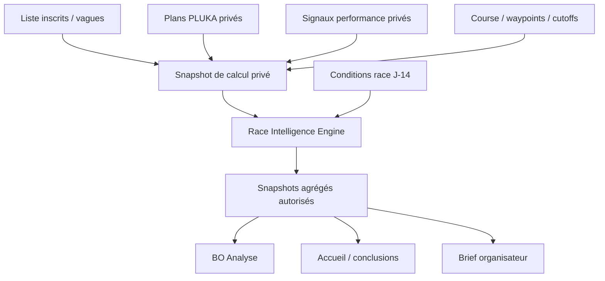

# PLUKA — Race Intelligence Engine V1

**Fichier de référence :** `docs/engines/RACE_INTELLIGENCE.md`  
**Statut :** Spécification moteur de référence — V1 Beta, production sous gate de calibration  
**Date de consolidation :** 2026-09-03  
**Version moteur de départ :** `race-intelligence-v1-beta.1`  
**Principe :** intelligence avant-course, agrégée, explicable et prudente — jamais de prédiction individuelle exposée

---

# 0. Rôle de ce document

Ce document définit le moteur **Race Intelligence** de PLUKA.

Race Intelligence transforme :

```text
COURSE STRUCTURÉE
+
LISTE D’INSCRITS
+
VAGUES / DÉPARTS
+
PLANS PLUKA DISPONIBLES
+
SIGNAUX DE PERFORMANCE FACULTATIFS
+
CONDITIONS MÉTÉO À PARTIR DE J-14
```

en :

```text
COMPRÉHENSION DU PELOTON
+
FLUX PRÉVISIONNELS AGRÉGÉS
+
BARRIÈRES À SURVEILLER
+
EXPOSITION MÉTÉO AGRÉGÉE
+
CONCLUSIONS UTILES AVANT LE DÉPART
```

Le moteur n’est pas un outil de PC course.

Il ne suit pas les participants en temps réel.

Il ne fournit aucune ETA individuelle à l’organisation.

Il sert à répondre avant le départ à des questions comme :

> **Mon peloton est-il homogène ?**

> **Quand un point important du parcours devrait-il monter en charge ?**

> **Quelle barrière mérite une attention particulière ?**

> **Quelle part du peloton devrait traverser une zone pendant une Condition météo significative ?**

---

## 0.1 Documents de référence

Cette spec complète :

- `docs/00_PRODUCT_SPEC.md`
- `docs/01_ARCHITECTURE.md`
- `docs/02_DATA_MODEL.md`
- `docs/03_PRIVACY_RLS.md`
- `docs/engines/PLAN_ENGINE.md`
- `docs/engines/WEATHER_CONDITIONS.md`
- `docs/ACCEPTANCE_CRITERIA.md`

Le prototype figé sert de référence UX/UI.

Les chiffres Race Intelligence du prototype sont **des fixtures de démonstration**. Ils ne définissent aucune formule ou aucun seuil métier.

### Ordre de priorité

En cas de contradiction :

1. `00_PRODUCT_SPEC.md` fait foi sur le périmètre produit ;
2. ce document fait foi sur le moteur Race Intelligence ;
3. `03_PRIVACY_RLS.md` fait foi sur ce qui peut être exposé ;
4. `PLAN_ENGINE.md` fait foi sur les Plans individuels ;
5. `WEATHER_CONDITIONS.md` fait foi sur les Conditions ;
6. `01_ARCHITECTURE.md` fait foi sur les frontières techniques ;
7. `02_DATA_MODEL.md` et les migrations font foi sur la persistance existante ;
8. le prototype fait foi uniquement sur l’intention UX.

Une contradiction doit être signalée, jamais arbitrée silencieusement dans le code.

---

# 0.2 Changement de statut par rapport aux documents précédents

Le Product Spec et le Data Model indiquaient jusque-là :

> **Race Intelligence moteur réel : à spécifier avant production.**

Ce document remplit cette étape de spécification.

Il autorise :

- l’implémentation du moteur en mode `beta` ;
- les tests ;
- la calibration sur des données réelles autorisées ;
- l’utilisation dans des pilotes organisateurs.

Il **n’autorise pas à lui seul le mode `production`**.

Le passage en production exige le gate défini plus loin :

```text
spec validée
+
config calibrée
+
privacy/RLS validées
+
backtests suffisants
+
validation produit explicite
```

---

# 1. Positionnement

Race Intelligence applique le positionnement B2B suivant :

> **PLUKA aide l’organisation à mieux comprendre sa course avant qu’elle commence.**

Le moteur ne doit pas transformer le BO en outil analytique complexe.

L’expérience nominale reste :

```text
L’organisation fournit ses données
↓
PLUKA calcule
↓
PLUKA remonte quelques conclusions
↓
L’organisation approfondit seulement si nécessaire
```

La puissance est sous le capot.

La simplicité reste à l’écran.

---

# 2. Ce que Race Intelligence n’est pas

Race Intelligence V1 n’est pas :

- du live tracking ;
- un chronométreur ;
- un PC course ;
- une console médicale ;
- un outil de gestion d’incidents ;
- un outil de bénévoles ;
- un moteur de dimensionnement automatique des stocks ;
- un outil de transport ;
- une plateforme d’inscription ;
- un classement de participants ;
- un modèle de prédiction individuelle de DNF ;
- un score de risque individuel ;
- une garantie sur le débit réel d’un ravitaillement ;
- un moteur de simulation avancée des vagues dans le MVP visible.

Aucun comportement live ne doit être ajouté spontanément.

---

# 3. Principe directeur

> **Race Intelligence estime la forme agrégée du peloton à partir de signaux disponibles ; il ne prétend pas connaître le futur de chaque coureur.**

La sortie n’est jamais :

```text
Clément passera à Adelboden à 10:42
```

La sortie est :

```text
Adelboden
principal pic attendu : 10:40 → 11:20
```

ou :

```text
environ 180 à 230 passages attendus sur cette période
```

selon la granularité retenue.

---

# 4. Nature de la prévision

La terminologie officielle est :

> **Prévision PLUKA**

ou :

> **Prévision de préparation**

Elle repose sur :

- objectifs déclarés dans les Plans PLUKA ;
- structure du peloton ;
- vagues ;
- signaux relatifs de performance lorsque disponibles ;
- hypothèses explicitement versionnées.

Ce n’est pas une prévision temps réel.

Ce n’est pas une promesse de comportement réel.

---

# 5. Biais à reconnaître

Le moteur doit être conçu en assumant explicitement que :

1. un Plan PLUKA représente une **intention de préparation**, pas un chrono garanti ;
2. les utilisateurs PLUKA peuvent être un sous-échantillon non représentatif du peloton ;
3. un indice de performance peut être ancien ou imparfaitement adapté au format ;
4. tous les participants ne disposent pas d’un signal ;
5. les Plans peuvent évoluer jusqu’au départ ;
6. une course réelle subit des abandons, incidents, météo et variations non modélisés ;
7. les comportements aux ravitaillements ne sont pas identiques à un simple passage de ligne.

La sortie doit donc utiliser :

- plages ;
- agrégats ;
- couverture ;
- langage prudent.

---

# 6. Outputs V1

Le moteur produit quatre familles de résultats.

## 6.1 Peloton

- couverture de données ;
- dispersion par vague ;
- observations structurées.

## 6.2 Flux

- distribution temporelle par waypoint ;
- expected count ;
- lower / upper model range ;
- breakdown par vague lorsqu’affichable ;
- premier flux ;
- cœur du peloton ;
- pic ;
- fin du flux principal.

## 6.3 Barrières

- distribution agrégée des marges ;
- sensibilité ;
- comparaison par vague lorsque le seuil de confidentialité est respecté.

## 6.4 Conditions

À partir de J-14 :

- zone ;
- période significative ;
- pourcentage / nombre attendu exposé ;
- breakdown vague autorisé.

---

# 7. Outputs hors moteur

Les éléments suivants existent dans le B2B mais ne sont pas calculés par Race Intelligence :

- incohérences Sources ;
- questions participants ;
- adoption PLUKA ;
- changements officiels ;
- Brief organisateur.

Le Brief **consomme** Race Intelligence mais n’est pas le moteur Race Intelligence.

---

# 8. Architecture générale



Le calcul peut temporairement manipuler des données individuelles côté serveur.

**Seules les sorties agrégées autorisées sont persistées dans les tables B2B publiques.**

---

# 9. Package

Package cible :

```text
packages/race-intelligence
```

Le moteur principal doit rester indépendant :

- de React ;
- de Next.js ;
- de Supabase ;
- d’un provider ITRA ;
- d’un provider UTMB ;
- d’un provider météo ;
- d’un LLM.

Les repositories et adapters assemblent les snapshots.

---

# 10. Modes de run

Le Data Model définit :

```text
demo
beta
production
```

## 10.1 `demo`

Uniquement fixtures / prototype / storybook / E2E de démonstration.

Ne pas utiliser des données du prototype comme données réelles.

## 10.2 `beta`

Calcul réel sur pilotes autorisés.

Doit afficher clairement :

> Prévision PLUKA

et la couverture.

Le mode beta est le mode cible après implémentation de cette spec.

## 10.3 `production`

Refusé automatiquement tant que le gate de production n’est pas validé.

Le serveur doit contrôler le mode.

Le client ne choisit jamais arbitrairement `production`.

---

# 11. Inputs

Le moteur reçoit un snapshot cohérent d’une Race.

```ts
type RaceIntelligenceInput = {
  race: RaceIntelligenceRaceSnapshot
  participants: RaceIntelligenceParticipantInput[]
  planAnchors: PrivatePlanAnchorInput[]
  performanceSignals: PrivatePerformanceSignalInput[]

  weather?: RaceIntelligenceWeatherInput | null

  mode: 'demo' | 'beta' | 'production'
  config: RaceIntelligenceConfig
}
```

Le package ne lit pas directement la DB.

---

# 12. Snapshot Race

Minimum :

```ts
type RaceIntelligenceRaceSnapshot = {
  raceId: string
  timezone: string

  startDatetime: string

  waves: Array<{
    id: string
    sortOrder: number
    startDatetime: string
  }>

  waypoints: Array<{
    id: string
    sortOrder: number
    label: string
    distanceKm: number
    type: string
  }>

  cutoffs: Array<{
    id: string
    raceWaypointId: string
    cutoffDatetime: string
    basis: 'arrival' | 'departure'
  }>
}
```

---

# 13. Participant roster input

Le moteur a besoin de la population d’inscrits.

```ts
type RaceIntelligenceParticipantInput = {
  participantRaceId: string

  startWaveId: string | null
  effectiveStartDatetime: string

  status:
    | 'invited'
    | 'active'
    | 'other_eligible'
}
```

Le moteur n’a pas besoin du nom ou de l’email pour calculer.

Ils ne doivent donc pas figurer dans le snapshot moteur.

---

# 14. Participants éligibles au calcul

Inclure uniquement les inscriptions qui représentent effectivement un départ attendu selon le statut connu.

Exclure si déjà connu avant le run :

- withdrawn ;
- DNS explicitement enregistré ;
- participation archivée ne devant pas courir.

Le mapping exact des statuts doit être effectué dans le domaine.

Race Intelligence ne doit pas inventer un DNS.

---

# 15. Départ effectif

Pour chaque participant :

```text
personal_start_datetime
→ sinon start_wave.start_datetime
→ sinon race.start_datetime
```

La date/heure est résolue avant l’appel moteur.

Le moteur ne doit jamais calculer les flux avec une heure vague incorrecte.

---

# 16. Plans PLUKA comme signal temporel

Un Plan PLUKA actif peut alimenter Race Intelligence.

Le Plan reste privé.

Le moteur peut recevoir un snapshot technique minimal :

```ts
type PrivatePlanAnchorInput = {
  participantRaceId: string
  racePlanId: string
  planVersion: number

  startDatetime: string

  waypoints: Array<{
    raceWaypointId: string
    arrivalElapsedSeconds: number
    departureElapsedSeconds: number
  }>
}
```

Ne pas inclure :

- Nutrition ;
- Assistance ;
- notes ;
- bags ;
- objectifs textuels.

---

# 17. Signaux de performance

Le schéma privé permet actuellement :

```text
ITRA
UTMB
```

Ils proviennent de fichiers obtenus légitimement par l’organisation.

Aucun scraping n’est requis.

Contrat :

```ts
type PrivatePerformanceSignalInput = {
  participantRaceId: string

  provider: 'itra' | 'utmb'

  value: number
  category: string | null

  sourceRowId: string | null
}
```

---

# 18. ITRA et UTMB restent distincts

Règle absolue :

```text
ITRA PI + UTMB Index
```

ne deviennent jamais :

```text
score PLUKA = moyenne des deux
```

Le moteur ne doit pas :

- additionner ;
- moyenner ;
- convertir naïvement ;
- appliquer une formule magique entre les deux.

Chaque provider constitue un **cohort ordinal distinct**.

---

# 19. Rôle d’un indice externe

Dans Race Intelligence V1, un indice externe sert principalement à :

> **ordonner relativement des participants ayant la même source.**

Il n’est pas converti directement en :

```text
chrono = f(index)
```

sans calibration externe validée.

Cette décision est essentielle.

---

# 20. Adapter de signal

Le moteur reçoit / utilise une configuration de provider indiquant au minimum :

```ts
type PerformanceProviderConfig = {
  provider: 'itra' | 'utmb'

  direction:
    | 'higher_is_better'
    | 'lower_is_better'

  allowedCategories?: string[]
}
```

La sémantique d’un provider doit être validée avant activation.

Elle n’est jamais déduite du prototype.

---

# 21. Participant avec plusieurs signaux

Un participant peut avoir ITRA et UTMB.

Le moteur ne les combine pas numériquement.

Pour chaque run :

1. calculer la couverture de chaque provider ;
2. choisir un `primaryProvider` selon la configuration et la couverture ;
3. utiliser le provider primaire lorsqu’il existe pour le participant ;
4. autoriser un provider secondaire comme fallback uniquement s’il possède son propre cohort suffisant ;
5. ne jamais compter deux fois le même participant.

Le choix est audit-able dans le metadata du run.

---

# 22. Pourquoi les Plans sont la base temporelle

Un indice externe donne principalement une information de niveau relatif.

Il ne dit pas directement :

> passage au Rawil à 17:20.

Les Plans PLUKA donnent une structure temporelle réelle sur les waypoints de la Race.

La V1 utilise donc les Plans disponibles comme **cohorte d’ancrage temporel**.

Les indices servent ensuite à positionner relativement d’autres participants dans cette cohorte.

---

# 23. Principe du modèle V1

Le moteur ne cherche pas à créer une ETA exacte pour chaque participant.

Il construit des **contributions probabilistes / répartitions temporelles**.

Trois types de contribution :

```text
A. PLUKA_PLAN
B. PERFORMANCE_MAPPED
C. GENERIC_POOL
```

---

# 24. Hiérarchie des signaux

Ordre conceptuel :

```text
1. Plan PLUKA actif
2. Signal performance exploitable
3. Pool générique
```

Attention :

> priorité ≠ vérité.

Le Plan est seulement le signal temporel le plus directement exploitable.

---

# 25. Type A — PLUKA_PLAN

Pour un participant avec Plan :

le centre de sa contribution au waypoint `w` est :

```text
center_elapsed =
  plan_waypoint.arrival_elapsed_seconds
```

ou :

```text
departure_elapsed_seconds
```

si le calcul concerné utilise le départ du waypoint.

On ajoute ensuite une incertitude modèle autour de ce centre.

---

# 26. Le Plan n’est pas une heure certaine

Le moteur ne doit jamais traiter :

```text
ETA Plan
```

comme :

```text
heure réelle certaine
```

Même un participant avec Plan contribue à une distribution autour de son ETA.

La largeur est définie par la configuration calibrée.

---

# 27. Kernel temporel V1

La V1 utilise un kernel triangulaire déterministe.

Pour :

```text
centre = c
demi-largeur = h > 0
```

la densité est :

```text
f(t) =
  (1 - |t - c| / h) / h
```

pour :

```text
|t - c| <= h
```

et :

```text
0
```

ailleurs.

La surface totale est 1.

---

# 28. CDF du kernel triangulaire

Soit :

```text
x = t - c
```

Alors :

```text
F(t) = 0
si x <= -h
```

```text
F(t) =
  ((x + h)^2) / (2h^2)
si -h < x <= 0
```

```text
F(t) =
  1 - ((h - x)^2) / (2h^2)
si 0 < x < h
```

```text
F(t) = 1
si x >= h
```

La probabilité de passage dans un bucket `[a,b[` est :

```text
p_bucket =
  F(b) - F(a)
```

---

# 29. Incertitude d’un Plan

La demi-largeur d’un Plan est :

```text
h_plan(elapsed) =
  clamp(
    min_plan_uncertainty_seconds
      + elapsed × plan_relative_uncertainty,
    min_plan_uncertainty_seconds,
    max_plan_uncertainty_seconds
  )
```

Les valeurs numériques sont **configurées et calibrées**.

Cette spec ne les invente pas.

---

# 30. Type B — PERFORMANCE_MAPPED

Pour un participant sans Plan mais avec un signal externe exploitable :

1. calculer son percentile ordinal dans son provider ;
2. transformer ce percentile en quantile temporel ;
3. lire le quantile correspondant dans la distribution de Plans d’ancrage ;
4. produire un centre temporel ;
5. appliquer une incertitude plus large que la contribution Plan.

---

# 31. Percentile provider

Pour un provider donné et `N` valeurs valides :

- trier selon la direction ;
- gérer les ex æquo par mid-rank ;
- produire :

```text
performance_percentile ∈ [0,1]
```

avec convention :

```text
1 = meilleur rang relatif
0 = rang le plus faible
```

Aucun percentile n’est affiché nominativement dans le BO.

---

# 32. Mid-rank

Pour un groupe d’égalité occupant les positions :

```text
r_min ... r_max
```

utiliser :

```text
rank = (r_min + r_max) / 2
```

puis normaliser.

Cela rend le mapping déterministe.

---

# 33. Winsorisation

Pour éviter qu’une valeur extrême reçoive automatiquement le premier / dernier Plan disponible :

```text
p_used =
  clamp(
    performance_percentile,
    min_mapping_quantile,
    max_mapping_quantile
  )
```

Ces bornes appartiennent à la configuration calibrée.

---

# 34. Quantile temporel

Le meilleur percentile doit correspondre à un temps plus faible.

Donc :

```text
time_quantile =
  1 - p_used
```

Puis :

```text
mapped_elapsed(w) =
  empirical_quantile(
    plan_anchor_elapsed_values(w),
    time_quantile
  )
```

---

# 35. Quantile empirique déterministe

Utiliser une méthode de quantile explicitement figée dans le code.

Recommandation V1 :

interpolation linéaire sur positions triées :

```text
index = q × (N - 1)
lo = floor(index)
hi = ceil(index)
fraction = index - lo

Q(q) =
  values[lo] × (1 - fraction)
  + values[hi] × fraction
```

Toutes les valeurs sont des temps écoulés, jamais des timestamps absolus.

---

# 36. Pourquoi mapper des elapsed times

Les vagues peuvent démarrer à des heures différentes.

La cohorte d’ancrage fournit donc :

```text
elapsed depuis départ personnel
```

Le datetime participant est ensuite :

```text
effectiveStartDatetime
+
mapped_elapsed
```

Cela évite de confondre niveau et heure de vague.

---

# 37. Cohorte d’ancrage Plan

Le mapping utilise uniquement des Plans :

- actifs ;
- cohérents ;
- de la même Race ;
- couvrant les waypoints nécessaires ;
- ne présentant pas une corruption temporelle.

Le service peut construire :

- une cohorte Race globale ;
- une cohorte spécifique à une vague si suffisamment dense.

---

# 38. Cohorte par vague

Si la cohorte Plan d’une vague respecte :

```text
min_plan_anchors_per_wave
```

le moteur peut utiliser sa distribution spécifique.

Sinon :

```text
fallback = race-wide anchor cohort
```

puis le départ effectif de la vague est appliqué séparément.

Le seuil est configurable.

---

# 39. Cohorte cohérente entre waypoints

Pour les calculs multi-waypoints nécessitant une trajectoire cohérente, utiliser de préférence un ensemble d’ancres Plan possédant les waypoints nécessaires.

Le même quantile appliqué à des distributions issues d’une cohorte cohérente permet de conserver une progression monotone.

Le moteur doit vérifier :

```text
elapsed(w[n+1]) > elapsed(w[n])
```

pour tout timing mapped.

---

# 40. Repair monotone

Si, à cause de données incomplètes, un mapping produit une violation temporelle :

ne pas laisser un participant “arriver” à un point après le point suivant.

Appliquer une réparation déterministe minimale ou rejeter ce mapping.

Préférence V1 :

1. tenter cohort fallback plus cohérent ;
2. sinon exclure le signal du mapping ;
3. basculer sa contribution dans le pool générique.

Ne pas corriger par une valeur arbitraire cachée.

---

# 41. Incertitude PERFORMANCE_MAPPED

La demi-largeur est calculée via une configuration dédiée :

```text
h_performance(elapsed)
```

avec :

```text
h_performance >= h_plan
```

pour un même elapsed, après calibration.

La formule peut suivre la même structure `clamp` que Plan avec des paramètres distincts.

Le moteur ne doit pas traiter un index externe comme plus précis qu’un Plan personnel.

---

# 42. Type C — GENERIC_POOL

Les participants sans :

- Plan ;
- signal externe exploitable ;

ne reçoivent pas une ETA individuelle artificielle.

Ils forment un **pool générique agrégé**.

---

# 43. Distribution du pool générique

Pour un groupe générique de taille `G` :

la distribution au waypoint est construite depuis la cohorte Plan d’ancrage.

Conceptuellement :

```text
P_generic(bucket)
=
moyenne des probabilités kernelisées
des Plans d’ancrage
```

Puis :

```text
expected_generic_in_bucket
=
G × P_generic(bucket)
```

Aucun participant générique n’est associé individuellement à un centre horaire persistant.

---

# 44. Pool générique par vague

Lorsque la vague est connue :

- utiliser une cohorte Plan de cette vague si suffisante ;
- sinon cohorte Race globale ;
- appliquer le départ de la vague.

Les pools sont agrégés.

---

# 45. Pourquoi le pool générique est acceptable

Le moteur dit en substance :

> **Pour les participants sans signal individuel exploitable, nous répartissons le volume restant selon la forme observée dans la cohorte de préparation disponible.**

C’est une hypothèse.

Elle doit être visible via :

- couverture ;
- `generic_estimate_count` ;
- langage prudent.

---

# 46. Readiness du flux

Le moteur ne doit pas produire un flux détaillé si la cohorte temporelle d’ancrage est insuffisante.

Conditions minimum configurables :

```text
min_plan_anchors_total
min_plan_anchor_coverage_pct
min_waypoint_anchor_count
```

Si les seuils ne sont pas atteints :

```text
flow_readiness = insufficient
```

et le produit affiche :

> **Pas encore assez de données pour une prévision de flux exploitable.**

---

# 47. Important : pas de faux modèle générique externe V1

La V1 ne doit pas inventer un modèle :

```text
UTMB Index 500 → finish 13h12
```

ou :

```text
niveau moyen → vitesse 6,2 km/h
```

pour compenser une absence de Plans.

Sans cohorte d’ancrage suffisante :

- le moteur accepte de ne pas savoir ;
- la couverture reste limitée ;
- le flow peut rester indisponible.

C’est préférable à une fausse précision.

---

# 48. Évolution possible plus tard

Une version future peut utiliser :

- résultats historiques de l’épreuve ;
- résultats de courses comparables ;
- modèles de performance calibrés ;
- statistiques multi-éditions.

Mais cela exige :

- nouvelles données ;
- nouvelle spec ;
- nouvelle version moteur.

Ce n’est pas implicitement inclus dans V1.

---

# 49. Couverture

Soit :

```text
N = nombre participants éligibles
P = participants avec Plan exploitable
S = participants sans Plan mais avec signal performance mappable
G = participants restant dans generic pool
```

Alors :

```text
usable_signal_count = P + S
```

et :

```text
coverage_pct =
  100 × usable_signal_count / N
```

`generic_estimate_count = G`.

---

# 50. Coverage label

Enum actuel :

```text
limited
partial
good
```

Les seuils sont définis dans :

```text
RaceIntelligenceConfig.coverageThresholds
```

Ils doivent être calibrés / approuvés.

Ne pas coder les pourcentages du prototype comme vérité.

---

# 51. Couverture spécifique Flow

La couverture globale ne suffit pas.

Le run doit aussi connaître :

- `plan_anchor_count` ;
- `plan_anchor_coverage_pct` ;
- couverture par waypoint ;
- coverage par provider ;
- nombre generic.

Ces valeurs peuvent être conservées dans le metadata / input snapshot agrégé.

---

# 52. Input snapshot public

`race_intelligence_runs.input_snapshot` est dans le schéma public B2B.

Il ne doit donc JAMAIS contenir :

- participant IDs ;
- RacePlan IDs individuels ;
- indices individuels ;
- objectifs ;
- ETA individuels.

Il peut contenir :

```json
{
  "participantCount": 1091,
  "planAnchorCount": 338,
  "planAnchorCoveragePct": 30.98,
  "performanceProviderCounts": {
    "itra": 420,
    "utmb": 690
  },
  "genericEstimateCount": 176,
  "primaryProvider": "utmb",
  "bucketMinutes": 30
}
```

---

# 53. Snapshot privé de reproductibilité

Pour une reproductibilité stricte, la V1 doit ajouter une structure dans le schéma `private`.

Recommandation :

```text
private.race_intelligence_run_inputs
```

ou :

```text
private.race_intelligence_run_members
```

Elle peut conserver pour chaque run :

- participant_race_id ;
- source type utilisé ;
- race_plan_id / version utilisé si Plan ;
- performance_signal_id utilisé si signal ;
- rôle dans le modèle :
  - plan ;
  - performance ;
  - generic.

Cette table :

- n’est jamais exposée à l’organisation ;
- sert à l’audit et au backtest ;
- est soumise à la politique de rétention.

---

# 54. Aucun ETA individuel dérivé persisté

Même dans le schéma privé, la V1 ne doit pas persister par défaut :

```text
participant X
estimated_rawil_datetime
```

pour les participants sans Plan.

Ces estimations intermédiaires sont calculées en mémoire dans le worker.

On persiste :

- les inputs privés ;
- les résultats agrégés.

Cela limite le risque de création d’un shadow tracking dataset.

---

# 55. Buckets temporels

Le Data Model supporte :

```text
5 à 180 minutes
```

La V1 utilise un `bucket_minutes` fourni par config.

Le prototype utilise principalement des fenêtres de 30 minutes, mais :

> **30 minutes n’est pas une vérité algorithmique.**

La config de pilote peut utiliser 30 min.

---

# 56. Probabilité par bucket

Pour chaque contribution individuelle kernelisée :

```text
p_i,b =
  P(participant i dans bucket b)
```

Pour un generic pool `g` :

```text
p_g,b =
  distribution empirique agrégée
```

---

# 57. Expected count

Pour un bucket `b` :

```text
mu_b =
  Σ_i p_i,b
  +
  Σ_g N_g × p_g,b
```

Puis :

```text
expected_count =
  deterministicRound(mu_b)
```

Le mode d’arrondi doit être stable.

Recommandation :

```text
round half away from zero
```

ou helper explicite équivalent.

Ne pas dépendre de différences runtime.

---

# 58. Variance modèle

Pour une contribution individuelle Bernoulli :

```text
var_i,b =
  p_i,b × (1 - p_i,b)
```

Pour un pool générique de taille `N_g` modélisé multinomialement :

```text
var_g,b =
  N_g × p_g,b × (1 - p_g,b)
```

Donc :

```text
variance_b =
  Σ var_i,b
  +
  Σ var_g,b
```

---

# 59. Lower / Upper model range

Le Data Model possède :

```text
lower_estimate
upper_estimate
```

La V1 peut utiliser :

```text
sigma_b = sqrt(variance_b)
```

Puis :

```text
lower =
  floor(mu_b - z_model × sigma_b)

upper =
  ceil(mu_b + z_model × sigma_b)
```

bornés à :

```text
[0, N]
```

`z_model` est une config calibrée.

---

# 60. Ce que lower / upper signifie

Ce n’est pas une garantie statistique du type :

> **95 % de chances que…**

car le modèle de comportement n’est pas une distribution empirique certifiée.

La terminologie UI recommandée est :

> **plage estimée**

ou :

> **prévision PLUKA**

Ne pas afficher :

> intervalle de confiance 95 %

sans calibration statistique spécifique.

---

# 61. Incertitude et biais modèle

La variance précédente ne couvre pas tous les biais :

- Plans trop optimistes ;
- population PLUKA non représentative ;
- abandon ;
- ralentissement météo ;
- congestion ;
- changement de comportement.

Le mode beta doit donc afficher une prudence éditoriale.

La calibration pourra élargir les kernels afin d’intégrer une partie de ces écarts observés.

---

# 62. Somme des buckets

Pour un waypoint et un groupe :

les probabilités doivent couvrir l’intervalle de calcul pertinent.

Si certains tails sortent de la fenêtre générée :

- créer des buckets supplémentaires ;
- ou conserver un bucket overflow technique.

Ne pas perdre artificiellement des participants.

La somme des expected counts arrondis n’a pas besoin d’être exactement `N` à cause de l’arrondi bucket par bucket ; la somme probabiliste pré-arrondi doit approcher exactement la population modélisée.

---

# 63. Premier passage / cœur / fin principale

Ces résumés sont dérivés de la CDF agrégée au waypoint.

Configuration :

```text
firstFlowQuantile
coreStartQuantile
coreEndQuantile
mainEndQuantile
```

Le prototype peut afficher par exemple :

```text
Premiers passages
Cœur du peloton
Fin du flux principal
```

mais les quantiles exacts doivent être configurés / calibrés.

---

# 64. Pic de passage

Le pic est le bucket ayant le `expected_count` maximal.

En cas d’égalité :

- choisir le premier bucket ;
- éventuellement fusionner des buckets adjacents du plateau selon config.

Résultat :

```text
peak_start
peak_end
peak_expected_count
peak_lower
peak_upper
```

Le schéma actuel stocke les buckets ; le résumé peut être calculé à la lecture ou persister dans `metrics`.

---

# 65. Charge qualitative

L’UI peut afficher :

```text
faible
normale
élevée
```

uniquement si une configuration métier de comparaison existe.

La charge ne doit pas être évaluée selon un nombre absolu universel.

Idéalement elle compare :

- le point à lui-même dans le temps ;
- ou le bucket au percentile de charge sur cette Race.

Cette logique est secondaire et doit être versionnée.

---

# 66. Wave breakdown

Pour un bucket :

```text
wave_breakdown
```

peut contenir les contributions agrégées par vague.

Règle de confidentialité :

- ne pas inclure une vague si son groupe source est inférieur au seuil ;
- ne pas exposer de breakdown permettant une ré-identification.

Le service B2B applique le privacy mask avant retour client.

---

# 67. Peloton — objectifs

L’écran Peloton doit pouvoir dire simplement :

```text
Vague 1 : plutôt homogène
Vague 2 : plutôt homogène
Vague 3 : plus dispersée
```

sans afficher de leaderboard.

---

# 68. Basis de dispersion

Le moteur ne doit pas mélanger des indices bruts hétérogènes.

Une vague possède un `dispersion_basis`.

Priorité :

1. `primaryProvider` si sa couverture de groupe est suffisante ;
2. à défaut, finish elapsed des Plans si couverture suffisante ;
3. sinon dispersion indisponible.

---

# 69. Dispersion sur provider

Avec un même provider :

- valeurs brutes appartenant au même système ;
- calculer médiane ;
- Q1 ;
- Q3 ;
- IQR.

Mesure robuste :

```text
dispersion_metric =
  IQR / max(abs(median), epsilon)
```

ou autre forme validée par la config.

La formule exacte doit être figée dans `algorithm_version`.

---

# 70. Dispersion sur Plan

Si la basis est Plan :

```text
values =
planned_finish_elapsed_seconds
```

Mesure robuste analogue :

```text
IQR / median
```

Le résultat reflète :

> dispersion des objectifs / préparations

pas :

> dispersion de capacité physiologique.

---

# 71. Dispersion labels

Enum :

```text
low
medium
high
```

Les seuils sont dans :

```text
config.dispersionThresholds
```

Pas dans le prototype.

---

# 72. Coverage vague

Chaque résumé vague doit afficher la couverture réellement utilisée pour son `dispersion_basis`.

Si :

```text
participant_count < privacy_min_group_size
```

aucun résumé détaillé de vague n’est affiché / persisté selon la règle SQL.

---

# 73. Niveau absolu du peloton

La V1 doit éviter de produire un score absolu ambigu du type :

> niveau moyen PLUKA = 638

Elle peut afficher :

- distribution d’un provider identifié ;
- couverture ;
- dispersion ;
- comparaison relative entre vagues.

Ne pas inventer un index universel PLUKA.

---

# 74. Flux par waypoint

Pour chaque RaceWaypoint utile :

1. construire les distributions des contributions ;
2. bucketiser les datetimes ;
3. sommer les contributions ;
4. calculer expected / lower / upper ;
5. produire le breakdown autorisé ;
6. persister.

---

# 75. Waypoints éligibles aux flux

Priorité :

- ravitos ;
- points Assistance ;
- contrôles ;
- barrières ;
- points structurants ;
- arrivée.

Le départ est généralement déjà connu par vague et n’a pas besoin du même moteur.

Le BO ne doit pas afficher 40 points sans utilité.

---

# 76. Flow forecast et passage réel

Un flow forecast représente :

> **passage au point**

Il ne représente pas directement :

- occupation totale du ravito ;
- file d’attente ;
- durée de présence ;
- consommation ;
- capacité de bénévoles.

Ces notions nécessitent d’autres données.

Ne pas appeler le graphique :

> charge réelle ravito

sans modèle spécifique.

---

# 77. Barrières — basis

Race Intelligence respecte exactement :

```text
arrival
```

ou :

```text
departure
```

comme Plan Engine.

Pour un Plan :

- utiliser l’elapsed correspondant.

Pour un mapped performance / generic pool :

- construire la distribution empirique du **même basis** dans la cohorte Plan.

---

# 78. Marges barrières

Pour une contribution temporelle :

```text
margin =
  cutoff_datetime
  - passage_reference_datetime
```

Buckets V1 alignés avec Plan Engine :

```text
> 60 min
30–60 min
0–30 min
< 0
```

Le dernier bucket signifie :

> au-delà dans le scénario actuel

et non :

> DNF prévu.

---

# 79. Expected margin buckets

Comme pour les flows :

- calculer une probabilité par bucket ;
- sommer les contributions ;
- persister des comptes / pourcentages agrégés.

Le JSON `margin_buckets` doit contenir une structure stable et versionnée.

Exemple :

```json
{
  "comfortable": {
    "expectedCount": 820,
    "expectedPct": 75.2
  },
  "watch": {
    "expectedCount": 180,
    "expectedPct": 16.5
  },
  "critical": {
    "expectedCount": 70,
    "expectedPct": 6.4
  },
  "beyond": {
    "expectedCount": 21,
    "expectedPct": 1.9
  }
}
```

Les chiffres ci-dessus sont un exemple de structure, pas une fixture produit.

---

# 80. Sensitivity label

Enum :

```text
normal
watch
high
```

La sensibilité est dérivée principalement :

- de la part attendue `<30 min` ;
- de la part attendue au-delà ;
- éventuellement de leur concentration dans une vague.

Les seuils sont calibrés dans :

```text
config.cutoffSensitivityThresholds
```

---

# 81. Formulation barrière

Préférer :

> **Barrière à surveiller**

> **Une part plus importante de la vague 3 devrait arriver avec une marge faible.**

Éviter :

> **12 % des coureurs vont rater la barrière.**

Éviter absolument :

> **Coureurs à risque.**

---

# 82. Comparaison par vague

Un breakdown vague n’est affiché que si :

- groupe source >= seuil de confidentialité ;
- qualité des données suffisante.

Les petits groupes sont supprimés, pas fusionnés dans une catégorie qui permettrait de les reconstruire.

---

# 83. Conditions météo B2B

Le croisement météo est disponible uniquement dans la fenêtre définie par `WEATHER_CONDITIONS.md`.

Avant J-14 :

- aucun forecast B2B ;
- aucune tendance.

---

# 84. Source météo B2B

Race Intelligence ne doit pas lire les runs météo personnels des utilisateurs comme une source exposable à l’organisation.

Le calcul B2B doit utiliser :

- le WeatherProvider / cache technique autorisé ;
- des points / zones de Race ;
- les distributions agrégées de passage.

Il construit ensuite une exposition agrégée.

---

# 85. Weather exposure — waypoint

Pour une Condition sur un waypoint / secteur centré au waypoint :

```text
period = [start, end]
```

Pour chaque contribution :

```text
p_exposed =
  P(passage datetime ∈ period)
```

Puis :

```text
expected_exposed_count =
  Σ p_exposed
```

et :

```text
expected_exposed_pct =
  100 × expected_exposed_count / modeled_population
```

---

# 86. Population de référence Weather

Le pourcentage exposé doit expliciter son dénominateur.

Préférence produit :

```text
population totale des inscrits éligibles
```

si le generic pool est modélisé.

Si le moteur ne peut modéliser qu’une partie :

le résultat doit clairement indiquer :

```text
basé sur X % du peloton
```

Ne jamais afficher `68 % du peloton` si 68 % signifie seulement 68 % des participants connus sans contexte.

---

# 87. Weather exposure — segment

Pour une Condition portant sur un RaceSegment :

le moteur peut utiliser les distributions de :

- entrée de segment ;
- sortie de segment.

Un participant est considéré exposé si son intervalle de traversée estimé chevauche la période de Condition.

Pour une contribution individuelle / performance :

```text
entry_center
exit_center
```

sont disponibles de manière éphémère.

Pour generic pool :

utiliser les trajectoires / distributions appariées de la cohorte Plan.

---

# 88. Segment exposure Beta

Le calcul segment est plus sensible aux hypothèses.

Le V1 peut activer d’abord :

```text
waypoint / zone exposure
```

puis feature-flagger :

```text
segment exposure
```

jusqu’à validation.

Le Data Model supporte déjà les deux.

---

# 89. Weather summary

`weather_summary` peut contenir :

- température ;
- ressenti ;
- vent ;
- rafales ;
- pluie ;
- updatedAt.

Il ne doit contenir aucune donnée personnelle.

---

# 90. Conditions ≠ décision

Race Intelligence peut afficher :

```text
Froid + vent
≈ X % du peloton exposé
```

Puis :

```text
Kit froid actuellement non activé
```

Mais le moteur ne produit jamais :

```text
activate_cold_kit = true
```

La décision appartient à l’organisation.

---

# 91. Recalcul

Un run peut être déclenché lorsque :

- liste de participants modifiée ;
- vagues modifiées ;
- nouvel enrichissement accepté ;
- nouveaux Plans PLUKA disponibles ;
- Plans modifiés ;
- course / waypoint / cutoff modifié ;
- Conditions J-14 évoluées.

Le calcul est asynchrone.

---

# 92. Pas de recalcul à chaque interaction

Le BO lit le dernier snapshot completed.

Le worker recalcule selon :

- événement métier ;
- scheduler ;
- batch.

Il ne doit pas recalculer 1 000 participants à chaque ouverture de page.

---

# 93. Plan.updated

`plan.updated` peut invalider le run courant.

Mais le système doit batcher les changements.

Exemple :

```text
183 Plans créés / modifiés
↓
debounce / batch
↓
un nouveau Race Intelligence run
```

Pas 183 runs.

---

# 94. Participant import

Après import d’une nouvelle liste :

- calcul de couverture ;
- run éventuel.

Le flow ne doit pas demander à l’organisateur :

> recalculer le modèle ?

PLUKA le fait automatiquement.

---

# 95. Enrichment import

Après matching accepté :

- mettre à jour les signaux privés ;
- invalider / replanifier le run ;
- améliorer la couverture.

L’organisation ne configure pas un modèle analytique.

---

# 96. Runs immuables

Un `race_intelligence_run` completed représente un snapshot.

Il n’est pas réécrit.

Un nouveau calcul crée un nouveau run.

Le BO affiche le dernier run utilisable.

---

# 97. Input hash

Le schéma actuel doit être complété avec :

```text
input_hash
```

Le hash doit représenter :

- race / course geometry version ;
- waypoints ;
- cutoffs ;
- wave start datetimes ;
- roster membership hash ;
- Plans utilisés / versions ;
- performance signals utilisés / matched versions ;
- algorithm version ;
- config version ;
- calibration version ;
- weather input version si exposure calculée.

Les données privées nécessaires au hash sont canonicalisées côté serveur.

Seul le hash est exposé publiquement.

---

# 98. Determinisme

Même :

```text
snapshot inputs
+
algorithm_version
+
config_version
+
calibration_version
```

doit produire les mêmes outputs agrégés.

Interdits :

- random bootstrap non seedé ;
- LLM ;
- Date.now dans le calcul ;
- itération non stable ;
- provider externe appelé depuis le cœur pur.

La date de run est ajoutée par l’orchestrateur.

---

# 99. Pourquoi pas de bootstrap aléatoire V1

La V1 utilise :

- kernels déterministes ;
- probabilités analytiques ;
- variance analytique.

Cela facilite :

- tests ;
- reproductibilité ;
- audit.

Une future méthode de bootstrap peut être ajoutée si elle apporte une vraie valeur et reste reproductible.

---

# 100. Run result

Contrat conceptuel :

```ts
type RaceIntelligenceResult = {
  status: 'ok' | 'insufficient' | 'error'

  coverage: RaceIntelligenceCoverage

  readiness: {
    peloton: boolean
    flows: boolean
    cutoffs: boolean
    weatherExposure: boolean
  }

  waveSummaries: WaveSummaryResult[]
  waypointFlows: WaypointFlowBucketResult[]
  cutoffSummaries: CutoffSummaryResult[]
  weatherExposures: WeatherExposureResult[]

  observations: RaceIntelligenceObservation[]

  issues: RaceIntelligenceIssue[]

  metadata: {
    algorithmVersion: string
    configVersion: string
    calibrationVersion: string | null
    inputHash: string
  }
}
```

---

# 101. Observations

Le moteur peut produire des observations structurées.

Exemples :

```text
wave_dispersion_high
waypoint_peak
cutoff_watch
weather_exposure
coverage_limited
```

Une observation n’est pas un paragraphe IA.

```ts
type RaceIntelligenceObservation = {
  code: string
  attention: 'know' | 'verify'
  entityType: 'race' | 'wave' | 'waypoint' | 'cutoff' | 'weather'
  entityId: string | null
  metrics: Record<string, unknown>
}
```

Le frontend transforme cette structure en wording localisé.

---

# 102. Pas de LLM dans les conclusions

Le moteur ne dépend pas d’un LLM pour produire :

> La vague 3 est plus dispersée.

Cette phrase est issue d’une observation structurée.

Un LLM pourrait éventuellement reformuler un Brief plus tard, mais :

- les facts structurés restent la source ;
- aucune métrique ne doit être inventée ;
- la V1 peut rester 100 % template-driven.

---

# 103. Sélection des “À retenir”

L’écran Analyse affiche maximum quelques conclusions.

Le ranking des observations peut utiliser un ordre déterministe :

1. problème de couverture empêchant une analyse ;
2. cutoff `high` ;
3. weather exposure significative J-14 ;
4. cutoff `watch` ;
5. dispersion `high` ;
6. peak principal ;
7. autre insight.

L’ordre exact doit être dans la config produit.

Ne pas générer 15 alertes.

---

# 104. Attention levels

Race Intelligence produit principalement :

```text
know
verify
```

Il ne doit pas produire `todo` pour une prévision seule.

`todo` correspond plutôt à :

- conflit documentaire ;
- action organisateur explicite ;
- information à publier.

Une prévision ne doit pas créer artificiellement une obligation.

---

# 105. Confidentialité — règle absolue

L’organisation ne voit jamais :

- objectif individuel ;
- Plan individuel ;
- ETA individuel ;
- PlanWaypoint ;
- PlanSegment ;
- signal ITRA / UTMB individuel dans l’analyse ;
- Nutrition ;
- Assistance ;
- sortie personnelle ;
- question individuelle ;
- score de risque individuel.

---

# 106. Minimum group size

Le Data Model impose :

```text
minimum = 10 participants
```

pour les analyses de sous-groupes.

Cette règle est non négociable dans V1.

Elle peut être augmentée plus tard.

Elle ne doit pas être diminuée par un paramètre organisateur.

---

# 107. Privacy mask

Le moteur peut calculer des valeurs plus fines côté serveur.

Avant exposition B2B :

```text
RaceIntelligenceResult
↓
PrivacyMask
↓
OrganizerSafeResult
```

Le `PrivacyMask` :

- supprime petits sous-groupes ;
- masque breakdowns sensibles ;
- interdit filtres combinés ré-identifiants ;
- applique les règles de `03_PRIVACY_RLS.md`.

---

# 108. Pas de lecture SQL directe brute par le BO

Même si les tables `race_intelligence_*` sont agrégées, le BO ne doit pas disposer d’un accès générique permettant de reconstruire des petits groupes par requêtes arbitraires.

Préférer :

- repository serveur ;
- RPC sécurisée ;
- view safe ;
- endpoint métier.

Les policies RLS détaillées devront refléter ce principe.

---

# 109. Bucket inférieur à 10

Un bucket temporel peut mathématiquement avoir :

```text
expected_count < 10
```

Cela ne signifie pas automatiquement qu’il est interdit de le calculer.

Mais l’API organisateur doit appliquer une règle de présentation prudente.

Recommandation V1 :

si un filtre / breakdown permet d’isoler un groupe inférieur à 10 :

- ne pas afficher le nombre exact ;
- afficher éventuellement :
  - faible volume ;
  - `< 10` ;
  - ou masquer.

La décision finale sera figée dans `03_PRIVACY_RLS.md`.

---

# 110. Aucun filtre individuel

Interdits côté BO :

- nom ;
- email ;
- dossard → analyse ;
- participant ID ;
- index minimum + nationalité + catégorie permettant une micro-cohorte.

Les filtres V1 Race Intelligence restent limités à :

- Race ;
- vague ;
- waypoint ;
- éventuellement période.

---

# 111. Aucun leaderboard

Même si les signaux existent dans `private` :

interdit :

```text
1. Jean — 712
2. Marie — 699
```

Race Intelligence est un outil de compréhension du groupe.

---

# 112. Pas de “coureur à risque”

Interdit :

- risque DNF individuel ;
- “trop lent” ;
- “faible niveau” ;
- score de sécurité ;
- liste sous cutoff.

La barrière reste une distribution agrégée.

---

# 113. Frontières données de performance

`private.participant_performance_signals` reste strictement serveur.

Le BO peut voir :

```text
82 % disposent d’un signal exploitable
```

Il ne doit pas voir automatiquement :

```text
Clément : UTMB 518
```

dans Race Intelligence.

Le workflow d’import / matching peut afficher les données nécessaires à la correction du matching, mais c’est un contexte fonctionnel différent et restreint.

---

# 114. Données d’import

La liste participant peut contenir :

- nom ;
- email ;
- vague ;
- dossard.

Race Intelligence n’a pas besoin de ces PII pour le calcul après résolution du `participant_race_id`.

Le snapshot moteur doit être minimisé.

---

# 115. Question Insights

Les Questions participants ne font pas partie du calcul mathématique Race Intelligence.

Elles vivent dans :

```text
question_insight_snapshots
```

Elles peuvent être présentées dans le même BO et le même Brief.

Ne pas mélanger :

```text
question count
```

avec :

```text
performance / flow
```

dans un score unique.

---

# 116. Adoption

Même principe pour :

```text
organization_adoption_snapshots
```

L’adoption sert à expliquer :

- combien ont activé PLUKA ;
- pourquoi la cohorte Plan s’améliore.

Elle ne devient pas un coefficient secret du moteur.

---

# 117. Brief organisateur

Le Brief consomme :

- informations Course ;
- conflits Sources ;
- Race Intelligence safe ;
- Question Insights ;
- Adoption ;
- Conditions.

Le Brief ne doit jamais requêter directement les Plans individuels.

---

# 118. Brief snapshot

`organizer_briefs.content` doit être construit à partir de payloads déjà agrégés / safe.

Un lien public partagé ne doit pas avoir besoin d’exécuter Race Intelligence ou des requêtes privées.

---

# 119. Wording du Brief

Exemple valide :

> **Adelboden : principal pic attendu entre 10:40 et 11:20.**

Exemple invalide :

> **Nos algorithmes prédisent précisément 247 coureurs à 10:52.**

---

# 120. Calibration — nécessité

Avant mode production, le moteur doit être confronté à des courses réelles.

La calibration ne doit pas se baser uniquement sur :

- le prototype ;
- des intuitions ;
- une seule course.

---

# 121. Données de calibration idéales

Pour plusieurs épreuves autorisées :

- liste de départ ;
- vagues ;
- Plans PLUKA disponibles ;
- signaux ITRA / UTMB disponibles ;
- passages réels agrégés ou résultats split publics / fournis ;
- cutoffs ;
- météo ;
- abandons si disponibles sous forme adaptée.

Les données utilisées doivent respecter les droits d’utilisation.

---

# 122. Backtest Flow

Pour chaque waypoint :

comparer :

```text
forecast distribution
```

à :

```text
actual passage distribution
```

Mesures possibles :

- erreur du pic en minutes ;
- erreur du volume de peak bucket ;
- Wasserstein distance / Earth Mover Distance ;
- MAE par bucket ;
- couverture de la plage modèle.

Le choix final des métriques est une décision de calibration.

---

# 123. Backtest Cutoff

Comparer :

- distribution prévue des marges ;
- distribution réelle des passages par rapport au cutoff.

Ne pas utiliser cette calibration pour créer un risque DNF individuel.

---

# 124. Calibration kernels

Les paramètres à calibrer incluent :

```text
plan uncertainty
performance uncertainty
generic smoothing
mapping quantile clamp
min anchor counts
coverage thresholds
dispersion thresholds
cutoff sensitivity thresholds
z_model
summary quantiles
```

---

# 125. Biais de cohorte PLUKA

Le backtest doit comparer :

- Plans PLUKA ;
- participants non PLUKA ;
- niveau / vague si disponible.

Si la cohorte PLUKA est systématiquement différente :

le generic pool doit être ajusté ou le moteur doit rester en beta.

Ne pas masquer ce biais avec une “correction IA” opaque.

---

# 126. Calibration par type de course

Il est possible qu’une seule config ne soit pas adaptée à :

- trail court ;
- montagne technique ;
- ultra long.

Une future config peut être segmentée par typologie, mais :

- les catégories doivent être explicites ;
- les règles doivent être versionnées ;
- pas de classification opaque.

La V1 peut commencer avec une config unique si les backtests le permettent.

---

# 127. Production gate

`mode = production` est autorisé seulement si :

1. spec moteur approuvée ;
2. `algorithm_version` figée ;
3. `config_version` figée ;
4. `calibration_version` non nulle ;
5. backtests documentés ;
6. seuils d’erreur acceptés par Product ;
7. privacy review validée ;
8. RLS / safe API testées ;
9. aucun PII leak ;
10. wording UI validé ;
11. fixtures prototype séparées ;
12. mode production explicitement activé serveur.

---

# 128. Absence de calibration

Si la calibration n’est pas approuvée :

le moteur peut rester :

```text
beta
```

pour les pilotes.

Le produit doit alors utiliser un wording clair :

> **Prévision PLUKA · version bêta**

si nécessaire selon le contexte commercial.

---

# 129. Configuration

```ts
type RaceIntelligenceConfig = {
  configVersion: string
  approvedForProduction: boolean

  privacy: {
    minGroupSize: 10
  }

  coverageThresholds: {
    partialMinPct: number
    goodMinPct: number
  }

  anchors: {
    minPlanAnchorsTotal: number
    minPlanAnchorCoveragePct: number
    minPlanAnchorsPerWave: number
    minPlanAnchorsPerWaypoint: number
  }

  mapping: {
    minQuantile: number
    maxQuantile: number
    providerPreference: Array<'itra' | 'utmb'>
  }

  uncertainty: {
    plan: {
      minSeconds: number
      relativeToElapsed: number
      maxSeconds: number
    }
    performance: {
      minSeconds: number
      relativeToElapsed: number
      maxSeconds: number
    }
    generic: {
      wideningFactor: number
    }
  }

  flow: {
    bucketMinutes: number
    zModel: number

    firstFlowQuantile: number
    coreStartQuantile: number
    coreEndQuantile: number
    mainEndQuantile: number
  }

  dispersion: {
    lowMax: number
    mediumMax: number
  }

  cutoffs: {
    watchThreshold: number
    highThreshold: number
  }
}
```

Les noms peuvent évoluer au bootstrap.

Les concepts ne doivent pas disparaître.

---

# 130. Config production séparée du code

La config calibrée doit :

- être versionnée dans Git ou registre de config contrôlé ;
- posséder un identifiant immuable ;
- être déployée avec revue ;
- ne pas être éditable depuis le BO organisateur.

L’organisation ne paramètre pas les kernels.

---

# 131. Algorithm version

`algorithm_version` change si :

- formule kernel change ;
- mapping quantile change ;
- méthode de dispersion change ;
- méthode de lower/upper change ;
- logique generic pool change ;
- cutoff probability change.

Une modification uniquement de seuils calibrés peut changer `config_version` sans nécessairement changer l’algorithme.

---

# 132. Calibration version

`calibration_version` identifie :

- dataset de calibration ;
- période ;
- config validée ;
- rapport de backtest.

Le moteur doit pouvoir expliquer quel calibrage a produit un run.

---

# 133. Mapping vers `race_intelligence_runs`

Le schéma actuel possède :

- race ;
- mode ;
- status ;
- algorithm_version ;
- coverage ;
- counts ;
- input_snapshot ;
- timestamps.

À ajouter avant production réelle :

```text
config_version text
calibration_version text
input_hash char(64)
```

Éventuellement :

```text
readiness jsonb
primary_performance_provider enrichment_provider
```

ou les conserver dans `input_snapshot` si non filtrés / non contraints.

---

# 134. `race_intelligence_wave_summaries`

Le schéma actuel est adapté.

`metrics` peut contenir :

```json
{
  "basis": "utmb",
  "usableCount": 221,
  "median": 0,
  "q1": 0,
  "q3": 0,
  "iqr": 0,
  "dispersionMetric": 0
}
```

Si les scores bruts ne doivent pas être exposés au BO :

le repository safe retire `median/q1/q3` bruts et ne renvoie que :

- basis label ;
- coverage ;
- dispersion label.

---

# 135. `race_intelligence_waypoint_flows`

Le schéma actuel correspond au moteur :

- bucket ;
- expected ;
- lower ;
- upper ;
- breakdown.

Complément recommandé :

```text
modeled_count
coverage_pct
```

par waypoint si la couverture varie.

À défaut, les informations peuvent vivre dans un metadata du run, mais le modèle relationnel est plus propre si la couverture waypoint est régulièrement affichée.

---

# 136. `race_intelligence_cutoff_summaries`

Le schéma actuel convient pour :

- sensitivity ;
- participant_count ;
- margin buckets ;
- wave breakdown.

`participant_count` doit représenter le groupe modélisé / affichable, et son sens doit être documenté précisément.

---

# 137. `race_intelligence_weather_exposures`

Compléments utiles recommandés :

```text
expected_exposed_count
lower_exposed_count
upper_exposed_count
modeled_participant_count
coverage_pct
```

Le schéma actuel stocke uniquement `expected_exposed_pct`.

La UI simplifiée peut n’afficher que le pourcentage, mais l’audit sera meilleur avec count / denominator.

---

# 138. Table privée run inputs

Migration recommandée :

```sql
create table private.race_intelligence_run_members (
  run_id uuid not null,
  participant_race_id uuid not null,
  signal_type text not null,
  race_plan_id uuid,
  performance_signal_id uuid,
  primary key (run_id, participant_race_id)
);
```

Le SQL final devra :

- ajouter les FK ;
- ajouter checks ;
- ajouter index ;
- appliquer rétention ;
- ne jamais grant cette table à `anon` / `authenticated`.

---

# 139. Ne pas persister les kernels

Les distributions individuelles n’ont pas besoin d’être stockées.

Elles sont recalculables depuis :

- input members ;
- Plan versions ;
- performance signals ;
- config.

Le run public stocke seulement les agrégats.

---

# 140. Suppression utilisateur

Si un participant demande l’effacement de données privées :

le processus de rétention doit être défini dans `03_PRIVACY_RLS.md`.

Les snapshots agrégés historiques peuvent éventuellement être conservés s’ils ne permettent plus de ré-identification et si la politique légale le permet.

La table privée run members doit suivre la politique d’effacement.

---

# 141. Événements

Événements susceptibles d’invalider Race Intelligence :

```text
participant.imported
participant.updated
participant.withdrawn
start_wave.updated
plan.generated
plan.updated
performance.enrichment.updated
race.course_geometry.updated
race.cutoff.updated
weather.updated
```

Le domaine les transforme en demandes de recompute batchées.

---

# 142. Job

Job :

```text
race-intelligence.compute
```

Payload minimal :

```ts
{
  raceId: string
  requestedMode: 'demo' | 'beta' | 'production'
  reason: string
}
```

Le worker reconstruit le snapshot serveur.

Ne pas envoyer les données participantes complètes dans la queue.

---

# 143. Idempotence

Clé :

```text
race-intelligence.compute:
raceId:
inputHash:
algorithmVersion:
configVersion:
calibrationVersion
```

Un retry ne doit pas produire plusieurs runs identiques completed.

---

# 144. Batch / debounce

Les événements Plan peuvent être nombreux.

Le worker doit pouvoir regrouper les invalidations.

Exemple :

```text
race-intelligence.invalidate:{raceId}
```

puis scheduler / debounce.

La fenêtre exacte de debounce est une configuration d’infrastructure, pas une règle produit.

---

# 145. Performance

Pour quelques milliers de participants et dizaines de waypoints :

le moteur doit pouvoir tourner en worker sans infrastructure Big Data.

La V1 n’a pas besoin :

- Spark ;
- Kafka ;
- warehouse dédié ;
- microservice ML.

Un calcul TypeScript / SQL bien structuré suffit pour le pilote.

---

# 146. Complexité cible

Si :

```text
N = participants
W = waypoints
B = buckets
```

la stratégie doit rester approximativement :

```text
O(N × W × buckets utiles)
```

ou meilleure.

Le generic pool évite de simuler inutilement un participant sans signal un par un.

---

# 147. Mémoire

Les inputs individuels sont sensibles.

Le worker :

- les charge pour la durée du calcul ;
- produit les agrégats ;
- libère le contexte ;
- ne les écrit pas dans les logs.

---

# 148. Observabilité

Mesurer par run :

- participant_count ;
- plan_count ;
- performance_count par provider ;
- generic_count ;
- coverage_pct ;
- anchor coverage ;
- flow readiness ;
- duration_ms ;
- waypoints calculés ;
- buckets calculés ;
- cutoff count ;
- weather exposure count ;
- warnings ;
- algorithm/config/calibration versions.

---

# 149. Logs interdits

Ne pas loguer :

- noms ;
- emails ;
- indices avec identité ;
- ETA individuelles ;
- objectif individuel ;
- association participant → bucket.

Les logs techniques utilisent :

- run_id ;
- race_id ;
- counts ;
- versions ;
- codes.

---

# 150. Issues

Codes principaux :

```text
RI_NO_PARTICIPANTS
RI_PRIVACY_GROUP_TOO_SMALL
RI_PLAN_ANCHORS_INSUFFICIENT
RI_WAYPOINT_ANCHORS_INSUFFICIENT
RI_PERFORMANCE_COHORT_INSUFFICIENT
RI_PERFORMANCE_SIGNAL_INVALID
RI_MAPPING_NON_MONOTONIC
RI_FLOW_UNAVAILABLE
RI_CUTOFF_UNAVAILABLE
RI_WEATHER_OUTSIDE_WINDOW
RI_WEATHER_UNAVAILABLE
RI_PRODUCTION_NOT_APPROVED
RI_INPUT_CHANGED
```

---

# 151. `RI_PLAN_ANCHORS_INSUFFICIENT`

Ce warning ne doit pas être caché.

Produit :

> **Pas encore assez de Plans pour une prévision de flux fiable.**

Action possible :

- continuer à inviter les participants ;
- importer un enrichissement ;
- attendre davantage d’activations.

Mais l’enrichissement seul ne remplace pas la base temporelle si aucune cohorte Plan n’est disponible.

---

# 152. Mode sans enrichissement

Race Intelligence doit fonctionner sans ITRA / UTMB si suffisamment de Plans existent.

Dans ce cas :

- Plans = participants modélisés directement ;
- reste = generic pool.

L’enrichissement est un améliorateur, pas un prérequis.

---

# 153. Mode sans Plans suffisants

Le moteur peut encore produire :

- roster counts ;
- adoption ;
- éventuellement dispersion basée sur un provider unique suffisamment couvert.

Il ne produit pas de flow détaillé fiable.

C’est une différence importante entre :

```text
Peloton disponible
```

et :

```text
Flux disponible
```

---

# 154. Peloton readiness

Peloton est prêt si au moins une basis de dispersion respecte :

- privacy min group ;
- minimum source coverage configuré.

Sinon :

> **Données insuffisantes pour analyser la dispersion du peloton.**

---

# 155. Cutoff readiness

Cutoffs nécessitent :

- flow/timing model prêt ;
- cutoff structuré ;
- waypoint présent ;
- basis connu.

Si `basis` est inconnu :

Race Intelligence ne doit pas l’inventer.

---

# 156. Weather readiness

Weather exposure nécessite :

- J-14 ;
- timing model prêt ;
- forecast Race exploitable ;
- Condition significative.

Sinon la section n’affiche aucune exposition.

---

# 157. Tests fondamentaux — couverture

## RI01 — Aucun participant

Attendu :

```text
status = insufficient
RI_NO_PARTICIPANTS
```

---

## RI02 — 1 000 participants, 300 Plans, 500 signaux mappables

Attendu :

```text
usable = 800
coverage = 80 %
generic = 200
```

---

## RI03 — Signal externe mais pas assez de Plans

Attendu :

- Peloton éventuellement disponible ;
- Flow indisponible ;
- aucune conversion directe index → chrono.

---

# 158. Tests providers

## RI04 — ITRA uniquement

Attendu :

rank / percentile dans le cohort ITRA.

---

## RI05 — UTMB uniquement

Attendu :

rank / percentile dans le cohort UTMB.

---

## RI06 — ITRA + UTMB

Attendu :

aucune moyenne des scores.

Primary provider déterministe.

---

## RI07 — Ex æquo

Attendu :

mid-rank identique.

---

# 159. Tests quantile mapping

## RI08 — Performance forte

Percentile élevé.

Attendu :

mapped elapsed dans les quantiles rapides.

---

## RI09 — Winsorisation

Percentile extrême.

Attendu :

quantile borné par config.

---

## RI10 — Vagues différentes

Deux participants de même percentile mais deux starts différents.

Attendu :

elapsed similaire ;
datetime décalé par heure de vague.

---

# 160. Tests Plan contribution

## RI11 — Plan direct

Attendu :

kernel centré sur ETA Plan.

---

## RI12 — Plan tard dans la course

Attendu :

incertitude >= début de course selon config.

---

## RI13 — Plan modifié

Attendu :

nouvel input hash ;
nouveau run après batch ;
ancien run immuable.

---

# 161. Tests generic pool

## RI14 — 100 generic

Attendu :

aucun ETA individuel persisté.

Contribution groupée.

---

## RI15 — Cohorte Plan insuffisante

Attendu :

generic flow indisponible ;
pas de faux modèle.

---

## RI16 — Generic par vague

Attendu :

distribution elapsed + start wave correct.

---

# 162. Tests buckets

## RI17 — Somme probabiliste

Attendu :

somme pré-arrondi ≈ population modélisée.

---

## RI18 — Peak

Attendu :

bucket max choisi de manière déterministe.

---

## RI19 — Lower / upper

Attendu :

```text
0 <= lower <= expected <= upper <= N
```

si l’intervalle config le garantit sur la fixture.

---

# 163. Tests dispersion

## RI20 — Même provider

Vague A étroite, vague B large.

Attendu :

dispersion B > A.

---

## RI21 — Group < 10

Attendu :

aucun résumé organisation.

---

## RI22 — Pas de provider, Plans suffisants

Attendu :

basis Plan possible.

---

# 164. Tests cutoffs

## RI23 — Barrière arrivée

Attendu :

margin basé sur arrival.

---

## RI24 — Barrière départ

Attendu :

margin basé sur departure.

---

## RI25 — Vague plus proche cutoff

Attendu :

breakdown plus sensible si groupe affichable.

---

## RI26 — Beyond bucket

Attendu :

libellé :

> au-delà dans le scénario actuel

jamais DNF.

---

# 165. Tests météo

## RI27 — J-15

Attendu :

aucune Weather Exposure.

---

## RI28 — J-7

Condition Rawil + flow.

Attendu :

exposition agrégée.

---

## RI29 — Petit breakdown vague

Attendu :

breakdown supprimé.

---

## RI30 — Décision kit froid

Attendu :

aucune activation automatique.

---

# 166. Tests privacy

## RI31 — API organisateur

Attendu :

aucun participantRaceId dans le payload Race Intelligence.

---

## RI32 — Input snapshot public

Attendu :

aucune liste individuelle.

---

## RI33 — SQL private signals

Attendu :

pas de grant organisateur / authenticated direct.

---

## RI34 — combinaison de filtres

Attendu :

groupe <10 bloqué / masqué.

---

## RI35 — Brief

Attendu :

seulement OrganizerSafeResult.

---

# 167. Tests déterminisme

## RI36 — Même snapshot

Attendu :

mêmes flow buckets, mêmes labels, même hash.

---

## RI37 — Ordre des participants changé

Même set logique.

Attendu :

même résultat.

Les inputs sont triés / canonicalisés.

---

## RI38 — Run retry

Attendu :

pas de duplicate completed logique.

---

# 168. Tests production gate

## RI39 — config non approuvée

Demande production.

Attendu :

```text
RI_PRODUCTION_NOT_APPROVED
```

---

## RI40 — demo fixture

Attendu :

impossible de promouvoir simplement le run demo en production.

Un nouveau run est nécessaire avec inputs réels.

---

# 169. Tests monotonicité

## RI41 — mapped timeline

Attendu pour toute contribution mappée :

```text
elapsed(w[n+1]) > elapsed(w[n])
```

---

## RI42 — cohorte incomplète

Attendu :

fallback ou generic ;
pas de timeline incohérente.

---

# 170. Tests recalcul

## RI43 — nouvel import de 200 participants

Attendu :

invalidation + run batché.

---

## RI44 — 100 plans générés successivement

Attendu :

pas 100 runs obligatoires ;
mécanisme batch / debounce.

---

# 171. Tests wording contract

Les payloads ne doivent jamais exiger des textes comme :

- “prédiction certaine” ;
- “risque DNF” ;
- “coureur faible” ;
- “98 % fiable”.

Les observations doivent permettre le wording prudent de Product Spec.

---

# 172. Validation métier sur pilote

Avant production, chaque pilote doit permettre d’évaluer :

1. l’organisateur comprend-il la notion de prévision ?
2. les pics estimés sont-ils suffisamment utiles ?
3. les intervalles sont-ils interprétés correctement ?
4. la couverture est-elle comprise ?
5. le BO paraît-il simple ?
6. la distinction Plans / indices / generic est-elle assez transparente ?
7. les barrières aident-elles réellement à préparer ?
8. l’exposition météo ajoute-t-elle une valeur ?
9. aucune décision opérationnelle dangereuse n’est-elle automatisée ?

---

# 173. Affichage de la méthode

L’utilisateur organisateur n’a pas besoin de voir les formules.

Un drawer :

> **Comment PLUKA calcule ?**

peut expliquer simplement :

```text
PLUKA combine les horaires préparés par les coureurs,
les vagues de départ
et, lorsqu’ils sont disponibles,
des signaux de niveau utilisés uniquement de manière relative.

Les participants sans signal précis sont intégrés
dans une estimation agrégée.

Aucune préparation individuelle n’est visible par l’organisation.
```

---

# 174. Coverage drawer

Afficher par exemple :

```text
82 % du peloton dispose d’un signal exploitable.

31 % possède déjà un Plan PLUKA.

Le reste est intégré sous forme d’estimation agrégée
lorsque la couverture des Plans permet de le faire.
```

Ne pas afficher une fausse note de fiabilité.

---

# 175. Enrichissement dans l’UX

Après import :

```text
PLUKA peut améliorer l’analyse avec
une Startlist ITRA enrichie
ou un fichier UTMB Index.
```

Facultatif.

Le moteur ne doit pas créer de dépendance commerciale à ces providers.

---

# 176. Simulateur de vagues

Le prototype historique a exploré un simulateur.

Décision actuelle :

> **hors expérience MVP principale.**

Le moteur V1 ne doit pas exposer une commande :

```text
optimizeWaves()
```

sans nouvelle validation produit.

Les outputs actuels peuvent aider humainement l’organisation à réfléchir à ses vagues.

---

# 177. Stocks ravito

Même décision.

Race Intelligence V1 prédit :

```text
passages
```

pas :

```text
litres d’eau à acheter
```

Une future feature logistique nécessiterait :

- consommation réelle ;
- temps de séjour ;
- taille de flasques ;
- comportement ;
- calibration.

Hors scope.

---

# 178. Assistance accompagnants B2B

Le produit a exploré l’idée de flux accompagnants.

La V1 ne doit pas exploiter les rendez-vous Assistance privés pour créer un dashboard organisation sans nouvelle validation Privacy/Product.

Assistance reste privée.

Ne pas l’utiliser implicitement dans Race Intelligence.

---

# 179. Nutrition B2B

Même règle :

la Nutrition individuelle ne doit pas être utilisée pour prédire les besoins de ravito dans V1.

Hors scope.

---

# 180. Pourquoi ces exclusions

Race Intelligence doit rester centré sur sa valeur la plus forte et la plus défendable :

```text
PELoton
+
TEMPS
+
PARCOURS
```

Pas transformer PLUKA en suite logistique omnisciente.

---

# 181. Résumé algorithmique

Pipeline V1 Beta :

```text
1. charger Race structurée
2. résoudre roster et départs
3. charger Plans privés autorisés
4. charger signaux performance privés
5. choisir providers exploitables
6. calculer couverture
7. construire cohortes Plan
8. vérifier readiness
9. calculer dispersion peloton
10. construire contributions Plan
11. mapper performance par percentile → quantile Plan
12. construire generic pools
13. agrégater flows par waypoint / bucket
14. calculer model ranges
15. calculer cutoff summaries
16. à J-14, calculer Weather Exposure
17. appliquer PrivacyMask
18. générer observations
19. persister seulement les agrégats publics
20. produire un snapshot utilisable par Analyse / Accueil / Brief
```

---

# 182. Ordre d’implémentation recommandé

| Étape | Livrable |
|---|---|
| RI1 | contrats + config + production gate |
| RI2 | private run input snapshot |
| RI3 | coverage |
| RI4 | provider cohorts / percentiles |
| RI5 | Plan anchor cohort |
| RI6 | quantile mapping |
| RI7 | kernels temporels |
| RI8 | generic pools |
| RI9 | flow buckets |
| RI10 | lower / upper model ranges |
| RI11 | wave dispersion |
| RI12 | cutoff summaries |
| RI13 | PrivacyMask / safe repository |
| RI14 | observations / Analyse UI |
| RI15 | Weather Exposure J-14 |
| RI16 | Brief integration |
| RI17 | backtests pilote |
| RI18 | calibration |
| RI19 | production gate review |

---

# 183. Organisation package recommandée

```text
packages/race-intelligence/
├── src/
│   ├── index.ts
│   ├── contracts.ts
│   ├── config.ts
│   ├── validation.ts
│   ├── coverage.ts
│   ├── providers.ts
│   ├── percentile.ts
│   ├── quantiles.ts
│   ├── anchors.ts
│   ├── kernels.ts
│   ├── contributions.ts
│   ├── generic-pool.ts
│   ├── flows.ts
│   ├── model-range.ts
│   ├── dispersion.ts
│   ├── cutoffs.ts
│   ├── weather-exposure.ts
│   ├── observations.ts
│   ├── privacy-mask.ts
│   ├── hash.ts
│   └── issues.ts
│
└── tests/
    ├── fixtures/
    ├── coverage.test.ts
    ├── percentile.test.ts
    ├── quantiles.test.ts
    ├── kernels.test.ts
    ├── mapping.test.ts
    ├── generic-pool.test.ts
    ├── flows.test.ts
    ├── model-range.test.ts
    ├── dispersion.test.ts
    ├── cutoffs.test.ts
    ├── weather-exposure.test.ts
    ├── privacy-mask.test.ts
    ├── determinism.test.ts
    └── acceptance.test.ts
```

---

# 184. API pure

API principale :

```ts
calculateRaceIntelligence(
  input: RaceIntelligenceInput
): RaceIntelligenceResult
```

Sous-fonctions pures :

```text
calculateCoverage
selectPerformanceProviders
computeProviderPercentiles
buildPlanAnchorCohorts
mapPerformanceToTimelines
buildPlanContributions
buildGenericPools
aggregateWaypointFlows
computeModelRanges
calculateWaveDispersion
calculateCutoffSummaries
calculateWeatherExposure
buildRaceIntelligenceObservations
applyRaceIntelligencePrivacyMask
computeRaceIntelligenceInputHash
```

---

# 185. Orchestration serveur

Use case :

```text
computeRaceIntelligence
```

Responsabilités :

1. autoriser le calcul ;
2. choisir algorithm/config/calibration versions ;
3. charger données privées ;
4. créer run `running` ;
5. construire input hash ;
6. appeler moteur pur ;
7. persister agrégats ;
8. persister private run members ;
9. passer run `completed` ;
10. invalider / mettre à jour Brief ;
11. publier événement interne.

---

# 186. Échec transactionnel

Les outputs d’un run doivent être cohérents ensemble.

Approche recommandée :

- calcul complet en mémoire ;
- transaction d’écriture des agrégats ;
- run `completed` seulement après succès.

Si l’écriture échoue :

```text
run = failed
```

Aucun mélange partiel ne doit être considéré comme le run actuel.

---

# 187. Run courant

Le Data Model ne possède pas de `current_run_id` sur Race.

La V1 peut sélectionner :

```text
dernier run completed
par race
par mode autorisé
```

avec index approprié.

Si le besoin devient fréquent, ajouter un pointeur matérialisé plus tard.

Ne pas complexifier avant mesure.

---

# 188. Indexes recommandés

Ajouter si absents :

```text
race_intelligence_runs(race_id, status, completed_at desc)

race_intelligence_waypoint_flows(
  run_id,
  race_waypoint_id,
  time_bucket_start
)

race_intelligence_cutoff_summaries(run_id, race_cutoff_id)

race_intelligence_weather_exposures(run_id, start_datetime)

private.race_intelligence_run_members(run_id)
```

---

# 189. B2B API safe

Exemples de lectures métier :

```text
getOrganizerRaceAnalysis(raceId)
getOrganizerWaypointFlow(raceId, waypointId, waveId?)
getOrganizerCutoffDetail(raceId, cutoffId)
getOrganizerWeatherExposure(raceId)
```

Ces services :

- contrôlent membership organisation ;
- choisissent le run ;
- appliquent privacy ;
- ne renvoient aucune donnée participant.

---

# 190. Pas de “SELECT all Race Intelligence” côté client

Le navigateur ne doit pas avoir besoin de connaître :

- toutes les rows de tous les runs ;
- private input data ;
- historique complet.

L’API sert un payload minimal à l’écran.

---

# 191. Mobile

Le B2B est desktop-first.

Sur mobile :

- conclusions ;
- Brief ;
- un point clé ;
- warnings.

Les courbes détaillées peuvent être simplifiées.

Cette décision UI ne modifie pas le moteur.

---

# 192. Fixture demo

Les exemples du prototype peuvent être reconstruits comme fixtures :

```text
fixtures/demo-wild70/*
```

avec mention claire :

```text
DEMO
SIMULATED
NO AFFILIATION
```

Ils ne doivent jamais :

- servir à calibrer ;
- fixer un seuil ;
- entrer dans `production`.

---

# 193. Critères d’acceptation pour Claude Code

Le moteur Race Intelligence V1 Beta est correctement implémenté lorsque :

1. le package tourne sans Next.js ;
2. le package tourne sans Supabase ;
3. aucun appel externe n’existe dans le cœur ;
4. aucun LLM n’intervient dans le calcul ;
5. la même entrée donne le même résultat ;
6. les participants ne sont jamais exposés nominativement ;
7. les Plans restent privés ;
8. les signaux performance restent privés ;
9. ITRA et UTMB ne sont jamais moyennés ;
10. les indices ne sont jamais convertis directement en chrono par formule arbitraire ;
11. les Plans forment la cohorte d’ancrage temporel V1 ;
12. un participant avec Plan utilise son timing comme centre probabiliste ;
13. un participant performance-only est mappé ordinalement vers la cohorte Plan ;
14. un participant sans signal rejoint un generic pool ;
15. aucun ETA dérivé individuel generic/performance n’est persisté ;
16. la cohorte insuffisante bloque les flows plutôt que d’inventer un modèle ;
17. la couverture est calculée et exposée ;
18. les coverage labels viennent d’une config versionnée ;
19. les kernels sont déterministes ;
20. les quantiles sont déterministes ;
21. les timelines mappées sont monotones ;
22. les vagues utilisent les vrais départs ;
23. les flows utilisent des buckets versionnés ;
24. expected count est la somme probabiliste ;
25. lower / upper sont des plages modèle, pas une confiance statistique annoncée ;
26. les wave summaries respectent le seuil 10 ;
27. les dispersions ne mélangent pas les raw scores de providers différents ;
28. aucun leaderboard n’est possible via l’API Analyse ;
29. les cutoffs respectent arrival/departure ;
30. aucune sortie n’est intitulée risque DNF ;
31. Weather Exposure est absent avant J-14 ;
32. Weather Exposure est agrégé ;
33. aucun run météo personnel n’est exposé à l’organisation ;
34. aucune décision kit froid n’est prise automatiquement ;
35. le PrivacyMask s’exécute avant exposition B2B ;
36. les petits groupes sont supprimés / masqués ;
37. `input_snapshot` public ne contient aucune PII ;
38. un snapshot privé des inputs de run existe pour audit ;
39. les runs completed sont immuables ;
40. les recalculs sont batchables ;
41. les Plans modifiés invalident les outputs dépendants ;
42. le Brief consomme seulement une sortie safe ;
43. les données demo restent séparées ;
44. `production` est refusé sans config / calibration approuvée ;
45. les tests RI01–RI44 passent ;
46. un backtest pilote doit précéder le gate production.

---

# 194. Points à mettre à jour dans le Data Model / SQL

La rédaction de cette spec rend nécessaires ou fortement recommandés les compléments suivants avant implémentation du moteur réel :

## `race_intelligence_runs`

Ajouter :

```text
config_version
calibration_version
input_hash
```

Optionnel mais utile :

```text
primary_performance_provider
readiness jsonb
```

## `race_intelligence_waypoint_flows`

Recommandé :

```text
modeled_count
coverage_pct
```

## `race_intelligence_weather_exposures`

Recommandé :

```text
expected_exposed_count
lower_exposed_count
upper_exposed_count
modeled_participant_count
coverage_pct
```

## schéma `private`

Ajouter :

```text
race_intelligence_run_members
```

avec les références d’input individuelles nécessaires à l’audit, sans ETA dérivées.

Après décision sur ces champs :

- mettre à jour `02_DATA_MODEL.md` ;
- créer une migration séparée ;
- ne pas modifier une migration déjà appliquée.

---

# 195. Ce que cette spec ne fige volontairement pas

La spec définit le **modèle algorithmique** mais ne fige pas encore les valeurs numériques de calibration suivantes :

- minimum de Plans ;
- minimum de couverture Plan ;
- minimum provider ;
- quantile clamp ;
- largeur kernels ;
- coverage labels ;
- dispersion thresholds ;
- cutoff sensitivity thresholds ;
- `z_model` ;
- quantiles de “cœur du peloton” ;
- seuils d’exposition météo significative.

Ces valeurs doivent venir du pilote / backtest.

Elles appartiennent à :

```text
config_version
```

et non à des constantes copiées depuis le prototype.

---

# 196. Consigne finale

Race Intelligence doit rester fidèle à cette promesse :

> **PLUKA ne dit pas à l’organisation ce que fera chaque coureur.**

Il lui dit :

> **voilà comment votre peloton devrait se répartir, avec les données disponibles, et voilà ce qui mérite votre attention avant le départ.**

Les cinq règles absolues sont :

> **Aucune ETA individuelle exposée.**

> **Aucun mélange naïf ITRA / UTMB.**

> **Aucune fausse conversion index → chrono.**

> **Aucun flow détaillé lorsque la base temporelle est insuffisante.**

> **Aucune sortie production avant calibration et validation Privacy.**

---

**Fin — PLUKA Race Intelligence Engine V1**
